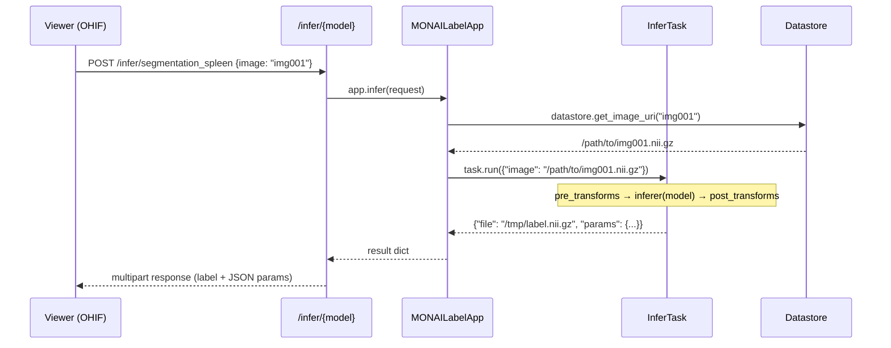
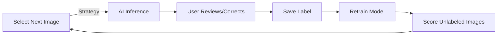
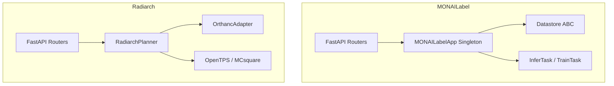

# MONAILabel Software Architecture & Usage

*Analysis based on MONAILabel v0.8.5 source code and [official documentation](https://monai.readthedocs.io/projects/label/en/latest/).*

---

## 1. What MONAILabel Is

MONAILabel is an **intelligent open-source image labeling platform** that lets researchers build AI-assisted annotation apps and expose them as REST services. It sits between a medical viewer (OHIF, 3D Slicer, QuPath, etc.) and a PACS/datastore, providing inference, active learning, and online training in a closed loop:

```
┌──────────────────────────────────────────────────────────────────────┐
│  Client Viewer                                                       │
│  (OHIF · 3D Slicer · QuPath · CVAT · DSA · MITK · CellProfiler)    │
└────────┬─────────────────────────────────────────────────────────────┘
         │  HTTP REST (JSON + multipart)
         ▼
┌────────────────────────────────────────────────────────────────────┐
│  MONAILabel Server (FastAPI / Uvicorn)                              │
│  ┌──────────┐ ┌──────────┐ ┌──────────┐ ┌──────────────────────┐  │
│  │ /info    │ │ /infer   │ │ /train   │ │ /activelearning      │  │
│  │ /model   │ │ /wsi_inf │ │ /scoring │ │ /batch_infer         │  │
│  │ /ohif    │ │ /session │ │ /logs    │ │ /datastore   /proxy  │  │
│  └──────┬───┘ └────┬─────┘ └────┬─────┘ └────────┬─────────────┘  │
│         │          │            │                 │                 │
│         └──────────┴─────┬──────┴─────────────────┘                │
│                          ▼                                          │
│              MONAILabelApp  (User's Application)                   │
│         ┌────────────┬─────────────┬──────────────┐                │
│         │ InferTasks │ TrainTasks  │ Strategies    │                │
│         │ (models)   │ (trainers)  │ (next-sample) │                │
│         └──────┬─────┴──────┬──────┴───────┬──────┘                │
│                │            │              │                        │
│                ▼            ▼              ▼                        │
│             Datastore  (images + labels + metadata)                │
└─────────────┬──────────────────────────────────────────────────────┘
              │  DICOMweb / filesystem / DSA / XNAT
              ▼
         ┌─────────┐
         │  PACS   │  (Orthanc, DCM4CHEE, etc.)
         └─────────┘
```

---

## 2. Core Architecture

### 2.1 Layered Design

| Layer | Source Directory | Responsibility |
|---|---|---|
| **Endpoints** | `monailabel/endpoints/` | 13 FastAPI routers — HTTP contract |
| **App Interface** | `monailabel/interfaces/app.py` | `MONAILabelApp` base class (781 LOC, 41 methods) |
| **Task Interfaces** | `monailabel/interfaces/tasks/` | `InferTask`, `TrainTask`, `Strategy`, `ScoringMethod` ABCs |
| **Datastore Interface** | `monailabel/interfaces/datastore.py` | `Datastore` ABC (28 abstract methods) |
| **Built-in Tasks** | `monailabel/tasks/` | `BasicTrainTask`, `Random/First` strategy, `BundleInferTask` |
| **Datastore Impls** | `monailabel/datastore/` | `LocalDatastore`, `DICOMWebDatastore`, `DSADatastore`, `XNATDatastore` |
| **Config** | `monailabel/config.py` | `Settings` (Pydantic BaseSettings, ~50 env-vars) |
| **Client** | `monailabel/client/client.py` | `MONAILabelClient` — Python HTTP client library |
| **Plugins** | `plugins/` | Viewer-side extensions: OHIF v2/v3, 3D Slicer, QuPath, CVAT, DSA, MITK |

### 2.2 The `MONAILabelApp` Singleton

Every MONAILabel application subclasses `MONAILabelApp` in a file called `main.py` inside the app directory. At server startup, `app_instance()` discovers this class, instantiates it **once**, and caches it as a singleton. All 13 endpoint routers delegate to this singleton:

```python
# monailabel/endpoints/info.py
def app_info():
    instance: MONAILabelApp = app_instance()
    return instance.info()
```

The user app overrides **five hooks** to register its components:

| Hook | Returns | Purpose |
|---|---|---|
| `init_infers()` | `Dict[str, InferTask]` | Named inference models |
| `init_trainers()` | `Dict[str, TrainTask]` | Named training pipelines |
| `init_strategies()` | `Dict[str, Strategy]` | Active learning strategies |
| `init_scoring_methods()` | `Dict[str, ScoringMethod]` | Image scoring for strategy |
| `init_datastore()` | `Datastore` | Image/label storage backend |

### 2.3 Request Flow



### 2.4 Datastore Abstraction

The `Datastore` ABC defines 28 methods for managing images, labels, and metadata. Key methods:

| Method | Description |
|---|---|
| `list_images()` | All available image IDs |
| `get_image(id)` / `get_image_uri(id)` | Retrieve image data or URI |
| `get_labeled_images()` | Images with final labels |
| `get_unlabeled_images()` | Images without labels |
| `save_label(image_id, label, tag)` | Persist a new label |
| `update_image_info(id, info)` | Attach metadata (scores, timestamps) |

**Five implementations** are provided:

| Implementation | Backend | Use Case |
|---|---|---|
| `LocalDatastore` | Filesystem | Default for local studies |
| `DICOMWebDatastore` | DICOMweb (Orthanc, etc.) | Clinical PACS integration |
| `DSADatastore` | Digital Slide Archive API | Pathology WSI |
| `XNATDatastore` | XNAT REST API | Research imaging archives |
| `CVATDatastore` | CVAT API | Computer Vision annotation |

---

## 3. Configuration

All settings use `MONAI_LABEL_*` env-vars via Pydantic `BaseSettings`. Key groups:

| Group | Variables | Purpose |
|---|---|---|
| **Core** | `APP_DIR`, `STUDIES`, `APP_CONF` | App path, data path, key-value config |
| **Server** | `SERVER_PORT`, `CORS_ORIGINS`, `API_STR` | HTTP server config |
| **Auth** | `AUTH_ENABLE`, `AUTH_REALM_URI`, `AUTH_CLIENT_ID`, `AUTH_ROLE_*` | Keycloak RBAC |
| **Datastore** | `DATASTORE`, `DATASTORE_URL`, `DATASTORE_USERNAME/PASSWORD` | Remote datastore connection |
| **DICOMweb** | `QIDO_PREFIX`, `WADO_PREFIX`, `STOW_PREFIX`, `DICOMWEB_*` | DICOMweb tuning |
| **Tasks** | `TASKS_TRAIN`, `TASKS_STRATEGY`, `TASKS_SCORING`, `TASKS_BATCH_INFER` | Enable/disable task types |
| **Sessions** | `SESSIONS`, `SESSION_PATH`, `SESSION_EXPIRY` | Session management |
| **Inference** | `INFER_CONCURRENCY`, `INFER_TIMEOUT` | Concurrency controls |
| **Model Zoo** | `MONAI_ZOO_SOURCE`, `MONAI_ZOO_REPO` | MONAI Model Zoo downloads |

---

## 4. REST API Surface

### 4.1 Endpoints (13 Routers)

| Endpoint | Method | Purpose |
|---|---|---|
| `/info` | GET | App metadata: name, labels, models, trainers, strategies |
| `/infer/{model}` | POST | Run inference — accepts image ID or file upload, returns label + JSON |
| `/wsi_infer/{model}` | POST | Whole-slide inference for pathology |
| `/batch_infer/{model}` | POST | Run inference on multiple images |
| `/train` | GET / POST / DELETE | Training status, start training, stop training |
| `/train/{model}` | POST | Train a specific model |
| `/activelearning/{strategy}` | POST | Get next image to annotate using given strategy |
| `/scoring/{method}` | POST / DELETE | Run/stop scoring method |
| `/datastore` | GET / PUT / DELETE | List, upload, remove images and labels |
| `/model/{model}` | GET / PUT | Download or upload a model file |
| `/session` | POST / GET / DELETE | Manage temporary image sessions |
| `/logs/{lines}` | GET | Retrieve server logs |
| `/ohif/{path}` | GET | Serve embedded OHIF viewer static files |

### 4.2 Client Library

`MONAILabelClient` provides a Python HTTP wrapper:

```python
from monailabel.client.client import MONAILabelClient

client = MONAILabelClient("http://localhost:8000")
info = client.info()                                # GET /info
label, params = client.infer("segmentation", "img001")  # POST /infer/segmentation
next_img = client.next_sample("random")             # POST /activelearning/random
client.start_train(model="segmentation")            # POST /train/segmentation
```

---

## 5. Sample Applications

| App | Domain | Key Models |
|---|---|---|
| **radiology** | 3D CT/MRI | UNet, UNETR, DeepEdit, DeepGrow, SAM2 |
| **pathology** | WSI | NuClick, HoVerNet (nuclei segmentation) |
| **monaibundle** | Any | MONAI Model Zoo bundles (SwinUNETR, etc.) |
| **endoscopy** | 2D video | Tool tracking, DeepEdit |
| **vista2d** | 2D | Foundation model for universal segmentation |

Each app lives in `sample-apps/{name}/` with:
- `main.py` — `MyApp(MONAILabelApp)` subclass
- `lib/configs/` — per-model configuration classes
- `lib/infers/` — custom `InferTask` subclasses
- `lib/trainers/` — custom `TrainTask` subclasses

---

## 6. Usage Scenarios

### 6.1 Interactive Annotation (3D Slicer)
1. Start server: `monailabel start_server --app radiology --studies /data/ct`
2. Install MONAILabel plugin in 3D Slicer
3. Connect to `http://localhost:8000`
4. Click "Next Sample" → fetches image via `/activelearning/random`
5. Click "Run" → sends image to `/infer/segmentation_spleen` → receives mask
6. Correct errors → submit label → `/datastore` saves label
7. Periodically trigger training → `/train/segmentation` → model improves

### 6.2 OHIF + Orthanc (Web-Based)
1. Start Orthanc DICOMweb server with study data
2. Start MONAILabel: `monailabel start_server --app radiology --studies http://orthanc:8042/dicom-web`
3. Navigate to `http://localhost:8000/ohif/` (embedded OHIF viewer)
4. Load study → DICOMweb → invoke inference from OHIF panel
5. Labels returned as DICOM SEG and pushed back to Orthanc

### 6.3 Active Learning Loop


### 6.4 Model Zoo / Bundle Workflow
1. Download pre-trained bundle: `monailabel apps --name monaibundle --download`
2. Configure bundle model in `main.py`
3. Start server — bundle auto-loads as inference task
4. Fine-tune on local data via `/train`

---

## 7. Radiarch vs. MONAILabel — Comparison

### 7.1 How Radiarch References MONAILabel

Radiarch mirrors several MONAILabel patterns but adapts them for **treatment planning** rather than **image labeling**:

| Aspect | MONAILabel | Radiarch |
|---|---|---|
| **Purpose** | AI-assisted annotation | Treatment plan computation |
| **Core loop** | Infer → Annotate → Train → Repeat | Submit plan → MCsquare dose calc → Export DICOM |
| **Framework** | FastAPI + Uvicorn | FastAPI + Uvicorn |
| **Config** | Pydantic `BaseSettings` (`MONAI_LABEL_*`) | Pydantic `BaseSettings` (`RADIARCH_*`) |
| **PACS adapter** | `Datastore` ABC → 5 impls | `OrthancAdapterBase` → 2 impls (real + mock) |
| **Async tasks** | Internal `AsyncTask` (threading) | Celery (eager mode for dev) |
| **App model** | `MONAILabelApp` singleton with hooks | `RadiarchPlanner` class |
| **Client viewers** | OHIF, 3D Slicer, QuPath, CVAT, DSA, MITK | OHIF (planned) |
| **Auth** | Keycloak RBAC | Not yet (planned) |
| **API prefix** | `/` (configurable) | `/api/v1` |
| **Endpoint naming** | `/info`, `/infer`, `/train`, `/datastore` | `/info`, `/plans`, `/jobs`, `/workflows`, `/artifacts` |

### 7.2 Shared Patterns



Both follow the same architectural skeleton:
1. **Thin FastAPI routers** that delegate to a core app/planner object
2. **Pluggable PACS/datastore backend** behind an abstract base class
3. **Pydantic settings** driven by environment variables
4. **Decoupled compute** (inference/training in MONAILabel, dose calculation in Radiarch)

### 7.3 Key Differences

| | MONAILabel | Radiarch |
|---|---|---|
| **App discovery** | Dynamic: loads `main.py` from `APP_DIR` at runtime | Static: `RadiarchPlanner` is hardcoded |
| **Multiple models** | Many inference models per server | One planning engine (OpenTPS / synthetic) |
| **Training** | Built-in online training loop | No training — physics-based simulation |
| **Active learning** | Core feature (strategies, scoring) | Not applicable |
| **Artifact management** | Labels stored in datastore | Artifacts in in-memory store (DICOM files, DVH) |
| **Job queue** | `AsyncTask` (thread-based) | Celery with Redis broker |

### 7.4 Opportunities for Convergence

If Radiarch wants to align more closely with MONAILabel's API so OHIF plugins can be reused:

1. **`/info` return shape** — MONAILabel's `/info` returns `name`, `labels`, `models`, `trainers`, `strategies`, `config`. Radiarch's `/info` could add a `models` field listing available planning engines.
2. **Session management** — MONAILabel's `/session` endpoint lets clients upload temporary images. Radiarch could adopt this for plan review workflows.
3. **Client library** — Shipping a `RadiarchClient` Python class (mirroring `MONAILabelClient`) would simplify OHIF plugin development.
4. **Plugin pattern** — MONAILabel's OHIF v3 plugin (`plugins/ohifv3/`) could serve as a template for a Radiarch OHIF extension that submits plans and displays dose overlays.

---

## 8. Source Code Map

```
MONAILabel/
├── monailabel/
│   ├── app.py              # FastAPI application factory (13 routers, CORS, lifespan)
│   ├── main.py             # CLI entry point (start_server, apps, datasets, plugins)
│   ├── config.py           # Pydantic settings (~50 MONAI_LABEL_* env-vars)
│   ├── endpoints/          # 13 router modules
│   │   ├── info.py         # GET /info
│   │   ├── infer.py        # POST /infer/{model}  (multipart response)
│   │   ├── wsi_infer.py    # POST /wsi_infer/{model}
│   │   ├── train.py        # GET/POST/DELETE /train
│   │   ├── activelearning.py  # POST /activelearning/{strategy}
│   │   ├── scoring.py      # POST/DELETE /scoring/{method}
│   │   ├── datastore.py    # CRUD /datastore
│   │   ├── model.py        # GET/PUT /model/{name}
│   │   ├── session.py      # CRUD /session
│   │   ├── batch_infer.py  # POST /batch_infer/{model}
│   │   ├── ohif.py         # GET /ohif/{path} — static file server
│   │   ├── logs.py         # GET /logs/{lines}
│   │   ├── proxy.py        # Reverse proxy to datastore
│   │   └── login.py        # POST /auth (Keycloak)
│   ├── interfaces/
│   │   ├── app.py          # MONAILabelApp (781 LOC base class)
│   │   ├── datastore.py    # Datastore ABC (28 methods)
│   │   ├── config.py       # TaskConfig ABC
│   │   └── tasks/          # InferTask, TrainTask, Strategy, ScoringMethod ABCs
│   ├── datastore/
│   │   ├── local.py        # Filesystem-based datastore
│   │   ├── dicom.py        # DICOMweb (Orthanc/DCM4CHEE)
│   │   ├── dsa.py          # Digital Slide Archive
│   │   ├── xnat.py         # XNAT imaging archive
│   │   └── cvat.py         # CVAT annotation platform
│   ├── tasks/              # Built-in task implementations
│   │   ├── infer/          # BundleInferTask, etc.
│   │   ├── train/          # BasicTrainTask, BundleTrainTask
│   │   ├── activelearning/ # Random, First strategies
│   │   └── scoring/        # EpistemicScoring, etc.
│   ├── client/
│   │   └── client.py       # MONAILabelClient (HTTP wrapper)
│   └── utils/              # Async tasks, transforms, planner, etc.
├── sample-apps/            # Reference applications
│   ├── radiology/          # 3D CT/MRI segmentation
│   ├── pathology/          # WSI nuclei segmentation
│   ├── monaibundle/        # MONAI Model Zoo wrapper
│   ├── endoscopy/          # 2D tool tracking
│   └── vista2d/            # Foundation model
├── plugins/                # Viewer-side extensions
│   ├── ohif/               # OHIF v2 extension
│   ├── ohifv3/             # OHIF v3 extension
│   ├── slicer/             # 3D Slicer module
│   ├── qupath/             # QuPath extension
│   ├── cvat/               # CVAT integration
│   └── dsa/                # Digital Slide Archive
└── tests/                  # ~66 test files
```

---

## References

- [MONAILabel Documentation](https://monai.readthedocs.io/projects/label/en/latest/)
- [MONAILabel GitHub](https://github.com/Project-MONAI/MONAILabel)
- [MONAI Model Zoo](https://github.com/Project-MONAI/model-zoo)
- [Radiarch Architecture](file:///home/yyan7/work/SMIS/radiarch/docs/architecture.md)
