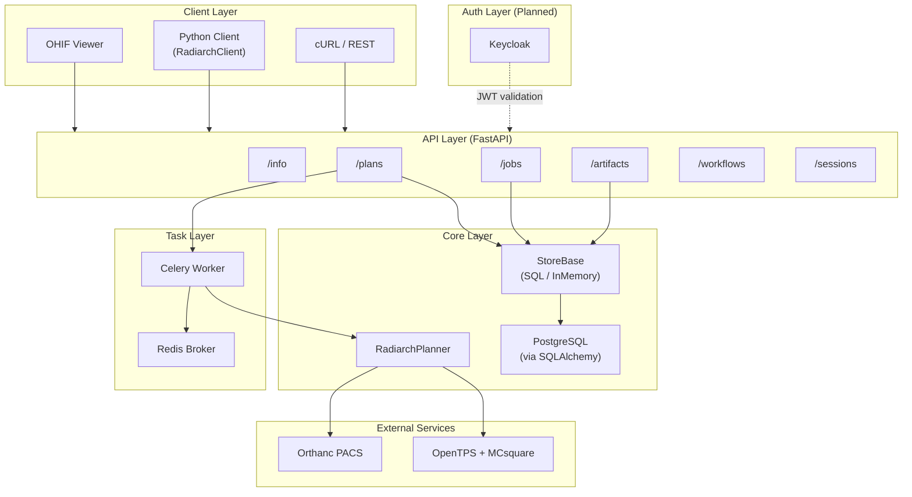
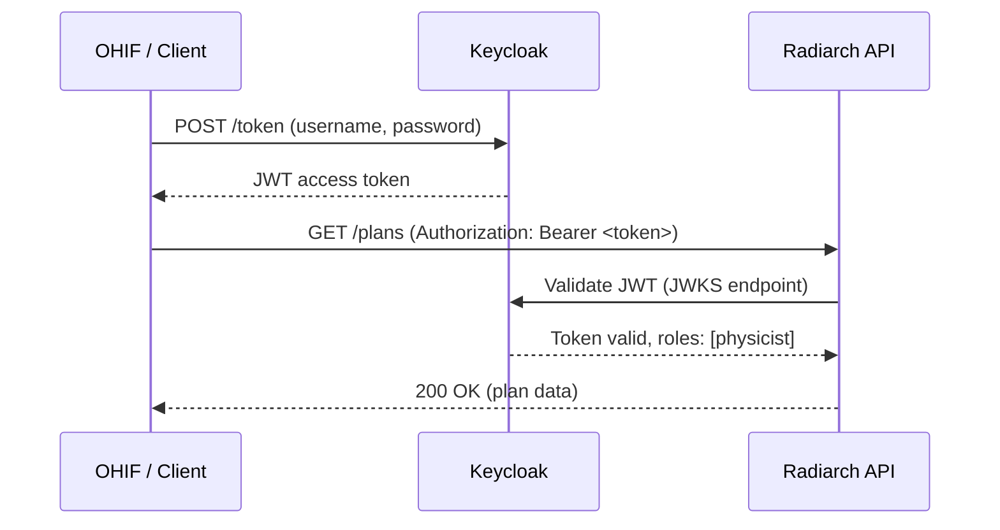

# Radiarch — Full Project Report

*Building a Cloud-Native Treatment Planning Service with AI-Assisted Development*

> **Author**: yyan7, with [Antigravity](https://deepmind.google) (Google DeepMind agentic coding assistant)
> **Date**: February 2026
> **Repository**: `/home/yyan7/work/SMIS/radiarch`

---

## 1. Executive Summary

Radiarch is a **cloud-native radiotherapy treatment planning service** that wraps [OpenTPS](https://opentps.github.io/) — an open-source proton/photon treatment planning system — behind a RESTful API. It enables DICOM-based treatment plan computation, dose calculation, and quality assurance through a containerized microservices architecture.

This document chronicles the end-to-end development of Radiarch across **7 completed phases** and **3 planned phases**, built entirely through pair programming with the Antigravity AI coding assistant. It covers the software architecture, each phase's goals and deliverables, the testing strategy, bugs encountered and resolved, and reflections on the AI-assisted development experience.

### Project Statistics

| Metric | Value |
|--------|-------|
| Lines of Python | ~2,200 |
| Source files | 20+ |
| Test cases | 20 (19 passing + 1 OpenTPS-dependent) |
| Docker services | 5 (API, Worker, Redis, Postgres, Orthanc) |
| API endpoints | 12 |
| Git commits | 7 |
| Development sessions | 2 |
| Phases completed | 7 |
| Phases planned | 3 |

---

## 2. Software Architecture

### 2.1 System Overview



### 2.2 Directory Structure

```
radiarch/
├── Dockerfile                    # Multi-stage Docker build
├── docker-compose.yml            # 5-service stack
├── .env.example                  # Environment variable template
├── .dockerignore
├── README.md                     # Quickstart + config reference
├── docs/
│   ├── radiarch_project_report.md  # This document
│   └── monailabel_architecture.md  # MONAILabel reference
├── ohif-extension/               # OHIF v3 extension (scaffold)
│   ├── package.json
│   ├── README.md
│   └── src/
│       ├── id.js                 # Extension ID
│       ├── index.ts              # Extension entry point
│       └── services/
│           └── RadiarchClientService.ts
├── service/
│   ├── radiarch/
│   │   ├── app.py                # FastAPI application factory
│   │   ├── config.py             # Pydantic Settings (RADIARCH_* env vars)
│   │   ├── client.py             # RadiarchClient SDK
│   │   ├── api/routes/
│   │   │   ├── info.py           # GET /info
│   │   │   ├── plans.py          # POST/GET/DELETE /plans
│   │   │   ├── jobs.py           # GET /jobs/{id}
│   │   │   ├── artifacts.py      # GET /artifacts/{id}
│   │   │   ├── workflows.py      # GET /workflows
│   │   │   └── sessions.py       # POST/GET/DELETE /sessions
│   │   ├── models/
│   │   │   ├── plan.py           # PlanRequest, PlanDetail, PlanWorkflow
│   │   │   ├── job.py            # Job state machine
│   │   │   └── artifact.py       # Artifact metadata
│   │   ├── core/
│   │   │   ├── planner.py        # RadiarchPlanner (synthetic + OpenTPS)
│   │   │   ├── store.py          # StoreBase, InMemoryStore, SQLStore
│   │   │   ├── database.py       # SQLAlchemy engine/session factory
│   │   │   └── db_models.py      # ORM models (PlanRow, JobRow, etc.)
│   │   ├── adapters/
│   │   │   ├── orthanc.py        # OrthancAdapter (DICOMwebClient)
│   │   │   ├── dicomweb.py       # DICOMwebNotifier (STOW-RS push)
│   │   │   └── sample_data.py    # Mock data for testing
│   │   └── tasks/
│   │       ├── celery_app.py     # Celery configuration
│   │       └── plan_tasks.py     # run_plan_job task with progress
│   └── tests/
│       ├── test_api_e2e.py       # 14 end-to-end API tests
│       ├── test_client.py        # 5 RadiarchClient tests
│       └── test_opentps_integration.py  # OpenTPS smoke test
```

### 2.3 Key Design Decisions

| Decision | Rationale |
|----------|-----------|
| **FastAPI** | Async support, automatic OpenAPI docs, Pydantic validation |
| **Celery + Redis** | Long-running dose calculations (5–30 min) must be async |
| **Dual-store pattern** (InMemory + SQL) | Easy local dev / testing with InMemoryStore; production Postgres via config |
| **Orthanc adapter abstraction** | Mock adapter for testing, real adapter for production |
| **Synthetic planner fallback** | Allows full API testing without OpenTPS/MCsquare installed |
| **Pydantic Settings** | All config via `RADIARCH_*` environment variables; no config files |
| **Docker Compose** | One-command deployment of 5 interdependent services |

### 2.4 API Endpoints

| Method | Endpoint | Description |
|--------|----------|-------------|
| `GET` | `/api/v1/info` | Service info, version, model registry, capabilities |
| `GET` | `/api/v1/workflows` | List all available planning workflows with parameters |
| `GET` | `/api/v1/workflows/{id}` | Get workflow detail (modality, engine, defaults) |
| `POST` | `/api/v1/plans` | Create plan → dispatch Celery job → return plan + job_id |
| `GET` | `/api/v1/plans` | List all plans |
| `GET` | `/api/v1/plans/{id}` | Get plan detail with QA summary, DVH, artifacts |
| `DELETE` | `/api/v1/plans/{id}` | Cancel plan and its job |
| `GET` | `/api/v1/jobs/{id}` | Poll job status, progress, stage, ETA |
| `GET` | `/api/v1/artifacts/{id}` | Download plan artifact (RTDOSE, JSON summary) |
| `POST` | `/api/v1/sessions` | Upload DICOM files for a session |
| `GET` | `/api/v1/sessions/{id}` | Get session info |
| `DELETE` | `/api/v1/sessions/{id}` | Delete session and uploaded files |

---

## 3. Development Phases — Completed

### Phase 1 — Project Scaffold

**Goal**: Bootstrap the project structure and basic FastAPI service.

**Context**: The project needed a clean Python service structure mirroring the MONAILabel architecture (which was studied as a reference for how medical AI services expose REST APIs). The key architectural insight from MONAILabel was the pattern of a service entry point that discovers and registers "models" (engines) at startup, exposes them via `/info`, and handles async inference via a task queue.

**What was built**:
- FastAPI application factory (`create_app()`) with configurable lifespan
- `/info` endpoint returning service name, version, and available workflows
- `config.py` using `pydantic-settings` for environment-based configuration with `RADIARCH_*` prefix
- Project layout following Python best practices: `service/radiarch/` package with `models/`, `api/`, `core/` sub-packages
- `pyproject.toml` with dependencies (FastAPI, Uvicorn, Pydantic, Celery, Redis)

**Key files created**: `app.py`, `config.py`, `api/routes/info.py`, `models/plan.py`

**Git commit**: `3cb0115 chore: scaffold Radiarch FastAPI service`

---

### Phase 2 — Orthanc Adapter & Celery Queue

**Goal**: Connect to the Orthanc PACS server for DICOM data retrieval and set up the async task queue for long-running dose calculations.

**Context**: Treatment plan computation can take 5–30 minutes (especially MCsquare Monte Carlo simulation). The API must return immediately and let clients poll for progress. Orthanc serves as the DICOM repository where CT images and RT structures are stored.

**What was built**:

*Orthanc adapter layer (`adapters/`)*:
- `OrthancAdapterBase` abstract class defining `get_study()` and `get_segmentation()` interfaces
- `OrthancAdapter` — production implementation using `dicomweb-client` library with `requests.Session` and `HTTPBasicAuth` for authenticated access
- `FakeOrthancAdapter` — mock implementation returning sample DICOM metadata for development and testing, built from `sample_data.py`
- `build_orthanc_adapter()` factory function that reads `RADIARCH_ORTHANC_USE_MOCK` to select the appropriate adapter

*Celery task queue (`tasks/`)*:
- `celery_app.py` — Celery app configured with Redis broker (`RADIARCH_BROKER_URL`) and result backend
- `plan_tasks.py` — initial `run_plan_job` task stub that accepts `job_id` and `plan_id`

*Planner stub (`core/planner.py`)*:
- `RadiarchPlanner` class with `run()` method dispatching to `_run_synthetic()` or `_run_opentps()`
- `PlanExecutionResult` dataclass with `artifact_bytes`, `qa_summary`, and `artifact_path`
- `force_synthetic` flag to bypass OpenTPS when MCsquare is not available

**Key files created**: `adapters/__init__.py`, `adapters/orthanc.py`, `adapters/sample_data.py`, `tasks/celery_app.py`, `tasks/plan_tasks.py`, `core/planner.py`

**Git commits**:
- `4ee0619 feat: add Orthanc adapter scaffold with mock mode`
- `1619d96 feat: add Celery scaffold with mock plan task`
- `42e2f94 feat: add planner stub wired to Celery and Orthanc`

---

### Phase 3 — End-to-End API & Testing

**Goal**: Complete the full REST API surface for treatment plans and verify with comprehensive integration tests.

**Context**: The API design follows REST conventions with resource-based URLs. The plan lifecycle is: `POST /plans` creates a plan record + dispatches a Celery job → client polls `GET /jobs/{id}` for progress → results appear in `GET /plans/{id}` (QA summary) and `GET /artifacts/{id}` (RTDOSE file).

**What was built**:

*API routes (`api/routes/`)*:
- `plans.py` — `POST /plans` (creates plan, stores in StoreBase, dispatches `run_plan_job` Celery task, returns plan with `job_id`), `GET /plans` (list all), `GET /plans/{id}`, `DELETE /plans/{id}` (cancels associated job)
- `jobs.py` — `GET /jobs/{id}` (returns job state, progress, stage, message, ETA)
- `artifacts.py` — `GET /artifacts/{id}` (looks up artifact metadata, streams file bytes)
- `workflows.py` — `GET /workflows` (lists available workflows with parameter schemas), `GET /workflows/{id}`

*Data models (`models/`)*:
- `plan.py` — `PlanRequest` (Pydantic model with `study_instance_uid`, `workflow_id`, `prescription_gy`, `fraction_count`), `PlanSummary`, `PlanDetail`
- `job.py` — `JobState` enum (`queued`, `running`, `succeeded`, `failed`, `cancelled`), `JobDetail` model
- `artifact.py` — Artifact metadata model with `content_type` and `file_path`

*Store layer (`core/store.py`)*:
- `StoreBase` abstract class defining the data access interface: `create_plan()`, `get_plan()`, `list_plans()`, `delete_plan()`, `create_job()`, `get_job()`, `update_job()`, `register_artifact()`, `get_artifact()`
- `InMemoryStore` — dictionary-backed implementation for development and testing
- `get_store()` factory function selecting store based on `RADIARCH_DATABASE_URL`

*Tests (`tests/test_api_e2e.py`)* — 14 integration tests covering the complete flow (see Section 5 for details)

**Key files created**: `api/routes/plans.py`, `api/routes/jobs.py`, `api/routes/artifacts.py`, `api/routes/workflows.py`, `core/store.py`, `models/job.py`, `models/artifact.py`, `tests/test_api_e2e.py`

---

### Phase 4 — Enriched Info, Sessions & Multi-Beam

**Goal**: Add session management for DICOM uploads, enrich the `/info` endpoint with a model registry, and support multi-beam treatment plans.

**Context**: Sessions allow users to upload DICOM files before submitting a plan. The `/info` endpoint was extended to follow MONAILabel's pattern of exposing available "models" (compute engines) with their status (`available`, `planned`). Multi-beam is essential for clinical plans — single-beam is rarely used in practice.

**What was built**:

*Session management (`api/routes/sessions.py`)*:
- `POST /sessions` — accepts DICOM file uploads via `multipart/form-data`, stores files temporarily, returns session ID and file count
- `GET /sessions/{id}` — retrieves session metadata
- `DELETE /sessions/{id}` — removes session and cleans up uploaded files
- Sessions have a configurable TTL (`RADIARCH_SESSION_TTL`, default 3600s) for automatic expiry

*Enhanced `/info` response*:
- Added `models` dictionary listing available compute engines: `proton-mcsquare` (status: `available`), `photon-ccc` (status: `planned`)
- Each model entry includes `engine`, `modality`, `status`, and `description`

*Multi-beam support*:
- Added `beam_count` field to `PlanRequest` (1–9 beams, validated with `ge=1, le=9`)
- `_run_synthetic()` calculates evenly-spaced gantry angles: `angle_i = i × (360° / beam_count)`
- QA summary includes `gantryAngles` list and per-beam metrics

**Key files created/modified**: `api/routes/sessions.py`, `api/routes/info.py` (enriched), `models/plan.py` (added `beam_count`)

---

### Phase 5 — Celery Hardening & Structured Progress

**Goal**: Make the task pipeline production-ready with structured progress reporting, timeout handling, retry policies, and a Python client SDK.

**Context**: In production, clients need real-time visibility into long-running dose calculations. The Celery task needed hardening against failures (network errors, MCsquare crashes, timeouts).

**What was built**:

*Structured progress in `plan_tasks.py`*:

The task reports progress through 5 distinct stages:

| Stage | Progress | Description |
|-------|----------|-------------|
| `initializing` | 5% | Starting plan workflow |
| `fetching` | 15% | Fetching study/segmentation from Orthanc |
| `computing` | 20% | Running dose calculation (MCsquare or synthetic) |
| `persisting` | 85% | Writing artifacts to store |
| `pushing` | 92% | STOW-RS push to PACS (if configured) |
| `done` | 100% | Plan completed with elapsed time |

Each stage update includes an ETA estimate based on elapsed wall-clock time.

*Error handling*:
- `autoretry_for=(ConnectionError, OSError)` with exponential backoff (up to 120s, 3 retries)
- `SoftTimeLimitExceeded` handling — marks job as `failed` with timeout message
- `PlannerError` for domain-specific failures
- Generic exception catch-all that logs full traceback

*DICOMweb STOW-RS notifier (`adapters/dicomweb.py`)*:
- `DICOMwebNotifier` pushes generated RTDOSE files back to any DICOMweb-compliant PACS
- Configured via `RADIARCH_DICOMWEB_URL` (empty = disabled)
- Non-fatal: push failures are logged as warnings, don't fail the job

*Python SDK (`client.py`)*:
- `RadiarchClient` class wrapping `httpx.Client`
- Methods: `info()`, `list_workflows()`, `create_plan()`, `get_plan()`, `get_job()`, `poll_until_done()`, `get_artifact()`
- `RadiarchClientError` exception with `status_code` attribute
- `poll_until_done()` implements exponential backoff polling loop

*SDK tests (`tests/test_client.py`)* — 5 tests using a `_TestClientWrapper` that bridges Starlette's `TestClient` to `RadiarchClient`'s `httpx`-style interface

**Key files created**: `client.py`, `adapters/dicomweb.py`, `tests/test_client.py`

---

### Phase 6 — Database Persistence

**Goal**: Replace the in-memory store with durable SQL storage for production use.

**Context**: `InMemoryStore` loses all data on restart and cannot be shared across processes (API + worker). Production needs PostgreSQL for durability and cross-process state sharing.

**What was built**:

*SQLAlchemy ORM models (`core/db_models.py`)*:
- `PlanRow` — maps to `plans` table (id, workflow_id, status, prescription_gy, beam_count, qa_summary JSON, timestamps)
- `JobRow` — maps to `jobs` table (id, plan_id, state, progress, stage, message, eta_seconds)
- `ArtifactRow` — maps to `artifacts` table (id, plan_id, file_path, content_type, file_name)
- `SessionRow` — maps to `sessions` table (id, file_paths JSON, created_at, ttl)
- All use `String` primary keys (UUID-based) for simplicity

*Database engine (`core/database.py`)*:
- `get_engine()` — creates SQLAlchemy engine from `RADIARCH_DATABASE_URL` (supports SQLite and PostgreSQL)
- `SessionLocal` — scoped session factory
- `init_db()` — creates all tables via `Base.metadata.create_all()` (auto-migration)
- `get_db()` — FastAPI dependency for request-scoped sessions

*SQL store (`core/store.py` — `SQLStore` class)*:
- Implements `StoreBase` with full CRUD using SQLAlchemy sessions
- Converts between ORM models (`PlanRow`) and Pydantic models (`PlanDetail`)
- `get_store()` factory: returns `SQLStore` if `RADIARCH_DATABASE_URL` is set, otherwise `InMemoryStore`

*Store compatibility*: All 19 tests pass identically with both `InMemoryStore` and `SQLStore`

**Key files created**: `core/database.py`, `core/db_models.py`; `core/store.py` extended with `SQLStore`

---

### Phase 7 — Docker Compose & Operations

**Goal**: Containerize the full stack for one-command deployment with proper service orchestration.

**Context**: The system requires 5 interdependent services: FastAPI API, Celery worker, Redis, PostgreSQL, and Orthanc. Docker Compose orchestrates them with health checks, proper networking, and volume persistence.

**What was built**:

*Multi-stage Dockerfile*:
- **Stage 1 (builder)**: Installs Python dependencies in a virtualenv
- **Stage 2 (runtime)**: Slim Python image with only runtime deps; copies virtualenv from builder
- Health check: `curl -f http://localhost:8000/` every 30s
- Default env: `RADIARCH_FORCE_SYNTHETIC=true` (MCsquare not bundled in image)

*Docker Compose services*:

| Service | Image | Ports | Purpose |
|---------|-------|-------|---------|
| `api` | radiarch (custom) | 8000 | FastAPI + Uvicorn |
| `worker` | radiarch (custom) | — | Celery with 2 prefork workers |
| `redis` | redis:7-alpine | 6379 | Broker + result backend |
| `postgres` | postgres:16-alpine | 5432 | Persistent SQL storage |
| `orthanc` | jodogne/orthanc | 8042, 4242 | DICOM server + DICOMweb |

All services share a Docker network. API and worker connect to Postgres via `RADIARCH_DATABASE_URL=postgresql+psycopg://...` and to Orthanc via `RADIARCH_ORTHANC_BASE_URL=http://orthanc:8042`.

*Configuration cleanup*:
- Parameterized hardcoded OpenTPS paths via `RADIARCH_OPENTPS_DATA_ROOT`, `RADIARCH_OPENTPS_BEAM_LIBRARY`, `RADIARCH_OPENTPS_VENV`
- `.env.example` documenting all 18 environment variables with defaults and descriptions
- `.dockerignore` excluding `MONAILabel/`, `opentps/`, `.git/`, `data/`, `__pycache__/`

*README rewrite*: Docker Compose quickstart, configuration table, Python client usage example

**Key files created**: `Dockerfile`, `docker-compose.yml`, `.env.example`, `.dockerignore`

---

## 4. Development Phases — Planned

### Phase 8 — OpenTPS Feature Integration

**Goal**: Extend the Radiarch API and planner to expose OpenTPS's full treatment planning capabilities: **plan optimization**, **photon dose computation**, **dose delivery simulation**, and enhanced **dose constraints**.

**Background**: Currently Radiarch supports one narrow path:
```
CT + RTStruct → Build proton plan (fixed geometry) → MCsquare dose → RTDOSE + DVH
```
OpenTPS provides much richer capabilities (see [Example Gallery](https://opentps.github.io/examples/auto_examples/index.html)) that are not yet exposed through the API.

> **Prerequisite**: All of 8A–8D require a working OpenTPS + MCsquare installation inside the Docker image (or volume-mounted). The current Docker setup uses `RADIARCH_FORCE_SYNTHETIC=true` because MCsquare is not bundled. Options: (1) volume-mount the OpenTPS venv into the container, or (2) build a Docker image that includes OpenTPS + MCsquare.

#### Phase 8A — Proton IMPT Optimization

The highest-value feature: enables clinically meaningful plans with dose objectives.

**API model changes** (`models/plan.py`):

```python
class ObjectiveType(str, Enum):
    d_min = "DMin"        # Minimum dose to structure
    d_max = "DMax"        # Maximum dose to structure
    d_uniform = "DUniform" # Uniform dose
    dvh_min = "DVHMin"    # DVH-based minimum
    dvh_max = "DVHMax"    # DVH-based maximum

class DoseObjective(BaseModel):
    structure_name: str          # ROI name (e.g. "PTV", "SpinalCord")
    objective_type: ObjectiveType
    dose_gy: float               # Dose value
    weight: float = 1.0          # Optimization weight
    volume_fraction: Optional[float] = None  # For DVH objectives (0-1)

class PlanRequest(BaseModel):
    # ... existing fields ...
    objectives: Optional[List[DoseObjective]] = None  # If set → run optimizer
    optimization_method: str = "Scipy_L-BFGS-B"
    max_iterations: int = 50
    spot_spacing_mm: float = 5.0
    layer_spacing_mm: float = 5.0
    scoring_spacing_mm: List[float] = [2, 2, 2]
    nb_primaries: float = 1e4    # For beamlet calc (1e6 for final)
    nb_primaries_final: float = 1e6
```

New `PlanWorkflow` entries: `proton-impt-optimized`, `proton-robust`, `photon-ccc`.

**Planner pipeline** (`core/planner.py` — new `_run_optimized_proton()` method):

1. Load patient data (CT + RTStruct) from Orthanc
2. Configure `MCsquareDoseCalculator` (calibration, BDL, scoring grid)
3. Build `ProtonPlanDesign` (gantry angles, spot/layer spacing, target margin)
4. Compute beamlets: `mc2.computeBeamlets(ct, plan, roi=[target, body])`
5. Map API objectives → OpenTPS objectives (`doseObj.DMin`, `doseObj.DMax`, `doseObj.DUniform`, `doseObj.DVHMin`, `doseObj.DVHMax`)
6. Run `IntensityModulationOptimizer(method='Scipy_L-BFGS-B', plan=plan, maxiter=50).optimize()`
7. Final dose computation with high primaries (1e6)
8. Export RTDOSE, compute DVH

**Key OpenTPS imports**:
```python
from opentps.core.processing.planOptimization.planOptimization import IntensityModulationOptimizer
import opentps.core.processing.planOptimization.objectives.dosimetricObjectives as doseObj
from opentps.core.data.plan import ObjectivesList
```

**Task progress stages**: `loading_data` → `building_plan` → `computing_beamlets` → `optimizing` → `final_dose` → `exporting`

#### Phase 8B — Photon CCC Dose Computation

Activates the `photon-ccc` workflow that is currently stub-only.

**New planner method** (`_run_photon_ccc()`):

1. Load CT from Orthanc
2. Create `PhotonPlan` with `PlanPhotonBeam` + `PlanPhotonSegment` (MLC leaf positions, jaw openings, monitor units)
3. Configure `CCCDoseCalculator` (CT calibration, batch size)
4. Compute dose: `ccc.computeDose(ct, plan)`
5. Export RTDOSE + DVH

**Additional `PlanRequest` fields for photon**:
```python
mlc_leaf_width_mm: float = 10.0   # MLC leaf width
jaw_opening_mm: List[float] = [-50, 50]
mu_per_beam: float = 5000
```

**Key OpenTPS imports**:
```python
from opentps.core.processing.doseCalculation.photons.cccDoseCalculator import CCCDoseCalculator
from opentps.core.data.plan._photonPlan import PhotonPlan
from opentps.core.data.plan._planPhotonBeam import PlanPhotonBeam
from opentps.core.data.plan._planPhotonSegment import PlanPhotonSegment
```

#### Phase 8C — Robust Proton Optimization

Extends 8A with robustness scenarios for uncertainty analysis — critical for proton therapy where setup errors and range uncertainty significantly affect dose distributions.

**New API model** (`models/plan.py`):
```python
class RobustnessConfig(BaseModel):
    setup_systematic_error_mm: List[float] = [1.6, 1.6, 1.6]
    setup_random_error_mm: List[float] = [0.0, 0.0, 0.0]
    range_systematic_error_pct: float = 5.0
    selection_strategy: str = "REDUCED_SET"  # REDUCED_SET | ALL | RANDOM
    num_scenarios: int = 5
```

**New planner method** (`_run_robust_proton()`):

1. Same as 8A but configure `planDesign.robustness = RobustnessProton()`
2. Use `mc2.computeRobustScenarioBeamlets()` instead of `computeBeamlets()`
3. Optimize with robust scenarios included in the objective function
4. Return worst-case DVH bands in QA summary

#### Phase 8D — Dose Delivery Simulation

PBS delivery timing and 4D dose simulation for motion management. This is a research/QA feature for evaluating plan robustness to patient breathing motion.

**New files**:
- `models/simulation.py` — `SimulationRequest` and `SimulationResult` models
- `api/routes/simulations.py` — `POST /simulations`, `GET /simulations/{id}`
- `core/simulator.py` — wrapper around OpenTPS's `PlanDeliverySimulation`

```python
class SimulationRequest(BaseModel):
    plan_id: str                          # Reference to completed plan
    simulation_type: str = "4d_dose"      # "4d_dose" | "4d_dynamic" | "fractionation"
    num_fractions: int = 5
    num_starting_phases: int = 3
    num_fractionation_scenarios: int = 7

class SimulationResult(BaseModel):
    id: str
    plan_id: str
    type: str
    status: str
    dvh_bands: Optional[dict] = None      # Min/max/nominal DVH per structure
    timing_data: Optional[dict] = None    # PBS spot delivery times
```

#### Phase 8E — Workflow Registry Cleanup

Update `api/routes/workflows.py` and `api/routes/info.py` with new workflow definitions and parameter schemas for all new capabilities.

#### Phase 8 — Effort & Priority Summary

| Sub-phase | Feature | Effort | Priority |
|-----------|---------|--------|----------|
| **8A** | Proton IMPT optimization | 3–4 days | 🔴 Critical — makes plans clinically meaningful |
| **8B** | Photon CCC dose | 2 days | 🟡 Medium — second modality |
| **8C** | Robust optimization | 2 days | 🟡 Medium — builds on 8A |
| **8D** | Delivery simulation | 2–3 days | 🟢 Lower — research/QA feature |
| **8E** | API cleanup & workflow registry | 1 day | 🟢 Lower — polish |

#### Phase 8 — Verification Plan

- Extend `test_api_e2e.py` with optimization parameter tests (synthetic mode)
- Add integration tests with `@pytest.mark.opentps` for real OpenTPS runs
- Test new `photon-ccc` workflow endpoint
- Submit an optimized plan via `curl` and verify optimizer convergence
- Compare DVH before/after optimization
- Verify RTDOSE is uploadable to Orthanc and viewable in OHIF

---

### Phase 9 — OHIF Viewer Integration

**Goal**: Build a full OHIF v3 extension that allows clinicians to submit plans, visualize dose, and review DVH directly from the OHIF viewer.

**Current state**: The OHIF extension scaffold exists in `ohif-extension/` with:
- Extension registration (`src/index.ts`, `src/id.js`)
- `RadiarchClientService` — HTTP client for communicating with the Radiarch API
- README with installation instructions and planned panel descriptions

**Planned components**:

| Component | Type | Description |
|-----------|------|-------------|
| `PlanSubmissionPanel` | OHIF Panel | Workflow selection dropdown, prescription dose input, beam count slider, target ROI picker. Submits `POST /plans` and shows real-time progress via job polling. |
| `DoseOverlayPanel` | OHIF Panel | Controls for dose color wash overlay (opacity, window/level, isodose lines). Fetches RTDOSE from `/artifacts/{id}` and renders as a cornerstone overlay on the CT viewport. |
| `DVHPanel` | OHIF Panel | Interactive dose-volume histogram chart (using Chart.js or Recharts) showing DVH curves per structure with D95/D5 annotations. |
| `RadiarchMode` | OHIF Mode | Custom OHIF mode that adds a "Treatment Planning" toolbar button and wires up the three panels into a planning layout. |

**Integration points**:
- OHIF's `ServicesManager` provides study/series metadata → maps to `study_instance_uid` for plan requests
- OHIF's cornerstone3D volume rendering → dose overlay as a labelmap or fusion viewport
- OHIF's measurement tools → beam angle annotations

**Changes to API**: The API needs a CORS configuration update to allow requests from the OHIF origin, and may need WebSocket support for real-time job progress (instead of polling).

---

### Phase 10 — Keycloak RBAC & Authentication

**Goal**: Secure the Radiarch API with JWT-based authentication using Keycloak, implementing role-based access control (RBAC) for clinical workflows.

**Planned architecture**:



**Planned roles**:

| Role | Permissions |
|------|-------------|
| `physicist` | Full CRUD on plans, view all jobs/artifacts, run optimizations |
| `dosimetrist` | View plans, download artifacts, run QA checks |
| `viewer` | Read-only access to plans and artifacts |
| `admin` | All permissions + user management, system config |

**Implementation plan**:
- Add `python-jose` / `authlib` for JWT decode and validation
- FastAPI dependency `get_current_user()` that validates `Authorization: Bearer` header against Keycloak's JWKS
- `@require_role("physicist")` decorator for role-based endpoint protection
- Keycloak service added to `docker-compose.yml` with pre-configured realm, clients, and roles
- `RADIARCH_AUTH_ENABLED` flag (default `false`) for backward compatibility
- `RADIARCH_KEYCLOAK_URL`, `RADIARCH_KEYCLOAK_REALM`, `RADIARCH_KEYCLOAK_CLIENT_ID` config variables

**Considerations**:
- Keycloak can also protect Orthanc access, centralizing auth for the entire stack
- OHIF extension needs to integrate with Keycloak's OIDC flow for browser-based login
- Service-to-service auth (worker → Orthanc) can use Keycloak client credentials grant

---

## 5. Testing Strategy

### 5.1 Testing Philosophy

The Radiarch test suite follows a **"test in isolation, verify in integration"** approach:

- **Unit-level**: Individual tests exercise single API endpoints or client methods
- **Integration-level**: The e2e test file verifies the full data flow across all layers (API → Store → Celery → Planner → Adapter)
- **External dependencies eliminated**: All tests run without Redis, PostgreSQL, Orthanc, or OpenTPS by using Celery eager mode, InMemoryStore, FakeOrthancAdapter, and the synthetic planner

### 5.2 Test Environment Setup

All three test files configure the environment at import time:

```python
os.environ["RADIARCH_ENVIRONMENT"] = "dev"
os.environ["RADIARCH_ORTHANC_USE_MOCK"] = "true"
os.environ["RADIARCH_FORCE_SYNTHETIC"] = "true"
```

This ensures:
- `FakeOrthancAdapter` is used (no real PACS connection)
- `_run_synthetic()` is called (no MCsquare binary needed)
- `InMemoryStore` is used (no database needed)

### 5.3 Celery Eager Mode

The most important testing decision: Celery's `task_always_eager = True` setting makes tasks execute **synchronously within the calling thread**. This means:

```python
# In production: POST /plans → returns immediately, task runs in worker
# In tests: POST /plans → task runs synchronously → by the time POST returns, the job is done
```

This eliminates the need for async test infrastructure, Redis, or worker processes. The eager mode is configured via the Celery app's `task_always_eager` setting.

### 5.4 Test Suites

#### `test_api_e2e.py` — 14 API Integration Tests

Uses FastAPI's `TestClient` (wrapping Starlette's ASGI test client) to make HTTP requests against the app in-process.

| Test | What it verifies |
|------|-----------------|
| `test_info` | `/info` returns name, version, and workflows |
| `test_list_workflows` | `/workflows` returns both `proton-impt-basic` and `photon-ccc` |
| `test_get_workflow_detail` | `/workflows/proton-impt-basic` has modality, engine, and default parameters |
| `test_get_workflow_not_found` | `/workflows/nonexistent` returns 404 |
| `test_create_and_get_plan` | Full lifecycle: POST plan → check job succeeded → check QA summary → download artifact |
| `test_list_plans` | `/plans` returns a list |
| `test_delete_plan` | DELETE cancels job, sets status to `cancelled` |
| `test_delete_plan_not_found` | DELETE nonexistent returns 404 |
| `test_get_artifact_not_found` | GET nonexistent artifact returns 404 |
| `test_info_has_models` | `/info` exposes model registry with `proton-mcsquare` (available) and `photon-ccc` (planned) |
| `test_sessions_crud` | Create → get → delete session lifecycle with uploaded file |
| `test_job_has_stage` | Completed job has `stage="done"` |
| `test_job_progress_polling` | Completed job has `progress=1.0`, `eta_seconds=0` |
| `test_create_plan_with_beam_count` | 3-beam plan produces 3 gantry angles in QA summary |

#### `test_client.py` — 5 SDK Tests

Tests the `RadiarchClient` Python SDK. Uses a `_TestClientWrapper` class that bridges Starlette's `TestClient` to `RadiarchClient`'s expected `httpx.Client` interface:

```python
class _TestClientWrapper:
    """Wraps Starlette TestClient to prepend base_url."""
    def __init__(self, test_client, base_url: str):
        self._tc = test_client
        self._base = base_url.rstrip("/")

    def get(self, path, **kwargs):
        return self._tc.get(f"{self._base}{path}", **kwargs)
```

The `RadiarchClient` is initialized by injecting this wrapper via `__new__` (bypassing the constructor), so no real HTTP server is needed.

| Test | What it verifies |
|------|-----------------|
| `test_client_info` | `client.info()` returns service name and models |
| `test_client_list_workflows` | `client.list_workflows()` returns workflow list |
| `test_client_create_and_poll` | `client.create_plan()` + `client.get_job()` lifecycle |
| `test_client_create_multibeam` | Multi-beam plan creation via SDK |
| `test_client_plan_not_found` | `RadiarchClientError` with 404 status code |

#### `test_opentps_integration.py` — 1 OpenTPS Test

A separate smoke test that exercises the real OpenTPS pipeline (not the synthetic fallback). It:
1. Imports `opentps` and checks it's available
2. Creates a `RadiarchPlanner` with a mock adapter
3. Runs `planner.run()` against `SimpleFantomWithStruct` test data
4. Verifies the result has `engine="opentps"` and valid `maxDose`

This test only passes when OpenTPS and MCsquare are installed with test data available. It is excluded from CI by default.

### 5.5 Running Tests

```bash
# Run all fast tests (19 tests, ~2 seconds)
cd service
RADIARCH_FORCE_SYNTHETIC=true RADIARCH_ORTHANC_USE_MOCK=true \
  python -m pytest tests/test_api_e2e.py tests/test_client.py -v

# Run OpenTPS integration test (requires OpenTPS + test data)
RADIARCH_OPENTPS_VENV=/path/to/opentps/venv/lib/python3.12/site-packages \
  python -m pytest tests/test_opentps_integration.py -v
```

---

## 6. Bugs & Issues Encountered

### 6.1 MCsquare Hang in E2E Tests

**Phase**: 5
**Symptom**: Celery task hung indefinitely when calling MCsquare dose calculator.
**Root cause**: MCsquare binary was being invoked as a subprocess without timeout. In eager mode, this blocked the test thread forever.
**Fix**: Added `subprocess.run(timeout=...)` and `task_time_limit` in Celery config. Also added `RADIARCH_FORCE_SYNTHETIC=true` default for Docker.

### 6.2 DICOMwebClient Authentication TypeError

**Phase**: 7
**Symptom**: `TypeError: DICOMwebClient.__init__() got unexpected keyword argument 'username'`
**Root cause**: The `dicomweb-client` library doesn't accept `username`/`password` as constructor kwargs. Authentication must be configured via a `requests.Session` object.
**Fix**: Created `requests.Session()` with `HTTPBasicAuth`, passed as `session=` to `DICOMwebClient`:

```diff
-self.client = DICOMwebClient(url=url, username="radiarch", password="radiarch")
+session = requests.Session()
+session.auth = HTTPBasicAuth("radiarch", "radiarch")
+self.client = DICOMwebClient(url=str(url), session=session)
```

### 6.3 Module-Level InMemoryStore Singleton

**Phase**: 7
**Symptom**: Docker worker container always used `InMemoryStore` despite `RADIARCH_DATABASE_URL` being set; worker logged `Job or plan missing`.
**Root cause**: `store.py` had `store = InMemoryStore()` at module level. All imports (`from ..core.store import store`) got this hardcoded instance, even when PostgreSQL was configured.
**Fix**: Replaced with a `_StoreProxy` proxy class that lazily delegates to `get_store()`:

```diff
-store = InMemoryStore()
+class _StoreProxy:
+    def __getattr__(self, name):
+        return getattr(get_store(), name)
+
+store = _StoreProxy()
```

### 6.4 Python Import-by-Value Bug

**Phase**: 7
**Symptom**: `get_store()` still returned `InMemoryStore` even after the proxy fix. `SessionLocal` was `None` inside `get_store()`.
**Root cause**: Classic Python gotcha — `from .database import SessionLocal` captured the variable's value (`None`) at import time. When `get_engine()` later set the global `SessionLocal` in `database.py`, the local reference in `store.py` remained `None`.
**Fix**: Changed to module-level attribute access:

```diff
-from .database import get_engine, SessionLocal
-get_engine()
-if SessionLocal is not None:  # Always None!
+from . import database
+database.get_engine()
+if database.SessionLocal is not None:  # Works!
```

### 6.5 Missing Orthanc Credentials in Docker Compose

**Phase**: 7
**Symptom**: Worker got `401 Unauthorized` when fetching study from Orthanc.
**Root cause**: `RADIARCH_ORTHANC_USERNAME` and `RADIARCH_ORTHANC_PASSWORD` were not set in `docker-compose.yml`, even though Orthanc was configured with `ORTHANC__REGISTERED_USERS`.
**Fix**: Added credentials to both `api` and `worker` environment sections in `docker-compose.yml`.

---

## 7. End-to-End Verification

### 7.1 Local Tests

All 19 tests pass consistently:

```
tests/test_api_e2e.py    — 14 tests (plan CRUD, jobs, artifacts, sessions, workflows)
tests/test_client.py     —  5 tests (RadiarchClient SDK)
```

### 7.2 Docker Stack E2E

Successfully verified the complete flow:

1. `docker compose up -d` — all 5 services healthy
2. Upload DICOM CT to Orthanc via REST API
3. `POST /api/v1/plans` — creates plan, dispatches Celery job
4. Worker fetches study metadata from Orthanc (authenticated)
5. Synthetic planner generates QA summary (3-beam, DVH, spot count)
6. `GET /api/v1/jobs/{id}` — returns `succeeded` with `progress=1.0`
7. `GET /api/v1/plans/{id}` — returns full QA summary with DVH data
8. `GET /api/v1/artifacts/{id}` — returns plan artifact JSON

### 7.3 Generated Plan Output

A successfully generated plan includes:

| Field | Example Value |
|-------|---------------|
| Engine | `synthetic` |
| Beam count | 3 |
| Gantry angles | 0°, 120°, 240° |
| Spot count | 630 |
| Target coverage (V95) | 84.1% |
| Max dose ratio | 1.116 |
| DVH | 50-point cumulative curve |

---

## 8. Development Experience with Antigravity

### 8.1 What Worked Well

**Rapid prototyping**: The entire project — from empty directory to a 5-service Docker stack with 20 passing tests — was built across 2 development sessions. Antigravity handled the boilerplate-heavy tasks (FastAPI routes, Pydantic models, Docker config, test scaffolding) with high accuracy.

**Debugging efficiency**: The Session 2 Docker debugging sequence (Section 6.3–6.5) showcases the iterative diagnosis pattern. Starting from a symptom (`Job or plan missing`), Antigravity methodically traced through: container env vars → `get_store()` return value → `SessionLocal` state → the Python import-by-value root cause. Each step narrowed the search space with targeted `docker exec` commands.

**API design**: The agent proposed clean REST conventions (resource-based URLs, proper HTTP methods, Pydantic validation) and maintained consistency across 12 endpoints without manual intervention.

**Test coverage**: Tests were generated alongside features, not as an afterthought. The eager-mode Celery testing pattern (avoid async complexity in tests) was a good design choice.

**Domain knowledge**: Antigravity researched OpenTPS documentation at runtime to understand the optimization API (`IntensityModulationOptimizer`, `dosimetricObjectives`), photon dose calculation (`CCCDoseCalculator`), and delivery simulation (`PlanDeliverySimulation`). This research informed the Phase 8 plan.

### 8.2 Challenges

**OpenTPS integration**: The real OpenTPS/MCsquare pipeline is complex — it requires specific binary executables, CT calibration files, beam delivery models, and a particular Python environment. Antigravity correctly identified this complexity and introduced the `force_synthetic` fallback early, which unblocked all testing.

**Docker layer caching**: After code changes, `docker compose build` sometimes served cached layers. Required explicit `--no-cache` to pick up source file changes. This is a standard Docker pitfall, not specific to AI-assisted development.

**Multi-container debugging**: When the API and worker used separate `InMemoryStore` instances, the symptom was subtle — the Celery task "succeeded" but did nothing. Diagnosing cross-container state issues required careful log correlation between services.

### 8.3 Observations

- **The agent excels at multi-file coordinated changes** — modifying models, routes, store, tests, and Docker config in lockstep with consistent naming and interfaces.
- **Domain knowledge gaps** were filled by reading documentation at runtime (e.g., `dicomweb-client` auth pattern, OpenTPS optimization API).
- **The synthetic/mock pattern** (for both the planner and Orthanc adapter) was essential — it allowed the full API to be developed and tested without external dependencies.

---

## 9. Configuration Reference

All settings are controlled via `RADIARCH_*` environment variables:

| Variable | Default | Description |
|----------|---------|-------------|
| `RADIARCH_ENVIRONMENT` | `dev` | `dev` / `production` |
| `RADIARCH_FORCE_SYNTHETIC` | `false` | Skip OpenTPS, use synthetic planner |
| `RADIARCH_DATABASE_URL` | *(empty)* | Postgres/SQLite URL; empty = InMemoryStore |
| `RADIARCH_BROKER_URL` | `redis://localhost:6379/0` | Celery broker |
| `RADIARCH_RESULT_BACKEND` | `redis://localhost:6379/1` | Celery results |
| `RADIARCH_ORTHANC_BASE_URL` | `http://localhost:8042` | Orthanc REST API |
| `RADIARCH_ORTHANC_USE_MOCK` | `true` | Use mock Orthanc adapter |
| `RADIARCH_ORTHANC_USERNAME` | *(none)* | Orthanc basic auth |
| `RADIARCH_ORTHANC_PASSWORD` | *(none)* | Orthanc basic auth |
| `RADIARCH_DICOMWEB_URL` | *(empty)* | DICOMweb STOW-RS push URL |
| `RADIARCH_ARTIFACT_DIR` | `./data/artifacts` | Artifact storage path |
| `RADIARCH_SESSION_TTL` | `3600` | Session expiry (seconds) |
| `RADIARCH_OPENTPS_DATA_ROOT` | `/data/opentps` | OpenTPS data directory |
| `RADIARCH_OPENTPS_BEAM_LIBRARY` | `/data/opentps/beam-models` | Beam model files |
| `RADIARCH_OPENTPS_VENV` | *(empty)* | OpenTPS venv site-packages path |

---

## 10. How to Run

### Docker Compose (recommended)
```bash
cd radiarch
docker compose up -d
curl http://localhost:8000/api/v1/info
```

### Local Development
```bash
cd service
python -m venv .venv && source .venv/bin/activate
pip install -e .
RADIARCH_FORCE_SYNTHETIC=true uvicorn radiarch.app:create_app --factory --reload
```

### Run Tests
```bash
cd service
RADIARCH_FORCE_SYNTHETIC=true RADIARCH_ORTHANC_USE_MOCK=true \
  python -m pytest tests/ -v
```
