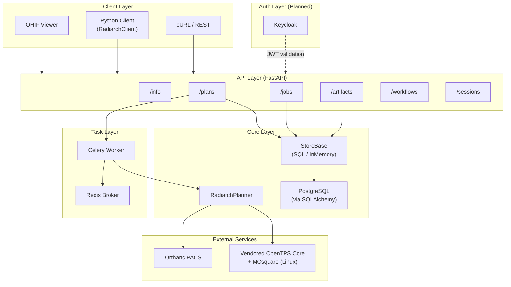
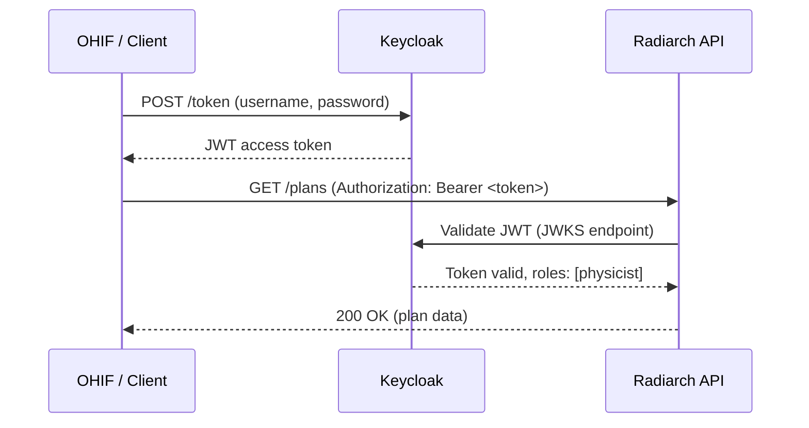

# Radiarch — Full Project Report

*Building a Cloud-Native Treatment Planning Service with AI-Assisted Development*

> **Author**: yyan7, with [Antigravity](https://deepmind.google) (Google DeepMind agentic coding assistant)
> **Date**: February 2026
> **Repository**: `/home/yyan7/work/SMIS/radiarch`

---

## 1. Executive Summary

Radiarch is a **cloud-native radiotherapy treatment planning service** that wraps [OpenTPS](https://opentps.github.io/) — an open-source proton/photon treatment planning system — behind a RESTful API. It enables DICOM-based treatment plan computation, dose calculation, and quality assurance through a containerized microservices architecture.

This document chronicles the end-to-end development of Radiarch across **11 completed phases**, built entirely through pair programming with the Antigravity AI coding assistant. It covers the software architecture, each phase's goals and deliverables, the testing strategy, bugs encountered and resolved, and reflections on the AI-assisted development experience.

### Project Statistics

| Metric | Value |
|--------|-------|
| Lines of Python | ~3,100 + 174 vendored OpenTPS files |
| Lines of JavaScript/TypeScript | ~2,260 |
| Python source files | 34 (service) + 174 (vendored opentps_core) |
| OHIF extension files | 8 |
| Test cases | 92 (all passing, including real MCsquare simulation) |
| Test files | 6 |
| Docker services | 5 (API, Worker, Redis, Postgres, Orthanc) |
| API endpoints | 14 |
| Git commits | 8 |
| Development sessions | 5 |
| Phases completed | 11 |

---

## 2. Software Architecture

### 2.1 System Overview



### 2.2 Directory Structure

```
radiarch/
├── Dockerfile                    # Multi-stage Docker build
├── docker-compose.yml            # 5-service stack
├── .env.example                  # Environment variable template
├── .dockerignore
├── README.md                     # Quickstart + config reference
├── docs/
│   ├── radiarch_project_report.md  # This document
│   └── monailabel_architecture.md  # MONAILabel reference
├── demo/
│   └── index.html                # Standalone browser demo (all 4 panels)
├── ohif-extension/               # OHIF v3 extension (4 panels, 8 commands)
│   ├── package.json
│   ├── README.md
│   └── src/
│       ├── id.js                 # Extension ID
│       ├── index.ts              # Extension entry point (wires all modules)
│       ├── commandsModule.js     # 8 commands bridging UI → API
│       ├── services/
│       │   └── RadiarchClient.js  # HTTP client (axios)
│       └── panels/
│           ├── PlanSubmissionPanel.js  # Workflow selection, Rx, objectives
│           ├── DVHPanel.js             # Dose-volume histogram (SVG)
│           ├── DoseOverlayPanel.js     # Opacity, colormap, isodose lines
│           └── SimulationPanel.js      # Delivery simulation (4D dose)
├── service/
│   ├── opentps/                  # Vendored opentps_core (Apache 2.0)
│   │   ├── ATTRIBUTION.md        # License + modification details
│   │   ├── LICENSE               # Apache 2.0
│   │   └── core/                 # 174 Python files
│   │       ├── data/             # CT, ROI, plan, dose data structures
│   │       ├── io/               # DICOM, MHD, MCsquare I/O
│   │       ├── processing/       # Dose calc (MCsquare, CCC), optimization, registration
│   │       └── utils/            # Config, settings
│   ├── radiarch/
│   │   ├── app.py                # FastAPI application factory
│   │   ├── config.py             # Pydantic Settings (RADIARCH_* env vars)
│   │   ├── client.py             # RadiarchClient SDK
│   │   ├── api/routes/
│   │   │   ├── info.py           # GET /info
│   │   │   ├── plans.py          # POST/GET/DELETE /plans
│   │   │   ├── jobs.py           # GET /jobs/{id}
│   │   │   ├── artifacts.py      # GET /artifacts/{id}
│   │   │   ├── workflows.py      # GET /workflows
│   │   │   ├── sessions.py       # POST/GET/DELETE /sessions
│   │   │   └── simulations.py    # POST/GET /simulations
│   │   ├── models/
│   │   │   ├── plan.py           # PlanRequest, PlanDetail, PlanWorkflow, DoseObjective, RobustnessConfig
│   │   │   ├── job.py            # Job state machine
│   │   │   ├── simulation.py     # SimulationRequest, SimulationResult
│   │   │   └── artifact.py       # Artifact metadata
│   │   ├── core/
│   │   │   ├── planner.py        # RadiarchPlanner orchestrator
│   │   │   ├── store.py          # StoreBase, InMemoryStore, SQLStore
│   │   │   ├── database.py       # SQLAlchemy engine/session factory
│   │   │   ├── db_models.py      # ORM models (PlanRow, JobRow, etc.)
│   │   │   └── workflows/        # Modular workflow runners
│   │   │       ├── __init__.py   # RUNNERS registry
│   │   │       ├── proton_basic.py
│   │   │       ├── proton_optimized.py
│   │   │       ├── proton_robust.py
│   │   │       ├── photon_ccc.py
│   │   │       └── _helpers.py   # Shared setup_sim_dir, build_mc_calculator
│   │   ├── adapters/
│   │   │   ├── orthanc.py        # OrthancAdapter (DICOMwebClient)
│   │   │   ├── dicomweb.py       # DICOMwebNotifier (STOW-RS push)
│   │   │   └── sample_data.py    # Mock data for testing
│   │   └── tasks/
│   │       ├── celery_app.py     # Celery configuration
│   │       └── plan_tasks.py     # run_plan_job task with progress
├── tests/
│   ├── test_api_e2e.py               # 21 end-to-end API tests
│   ├── test_client.py                # 5 RadiarchClient tests
│   ├── test_opentps_integration.py   # OpenTPS integration smoke test
│   └── opentps/core/
│       ├── conftest.py               # Shared fixtures and path setup
│       ├── test_api_backend.py       # 48 store/registry/model tests
│       ├── test_mcsquare_interface.py # 8 MCsquare python_interface tests
│       └── test_opentps_core.py      # 9 OpenTPS core pipeline tests
```

### 2.3 Key Design Decisions

| Decision | Rationale |
|----------|-----------|
| **FastAPI** | Async support, automatic OpenAPI docs, Pydantic validation |
| **Celery + Redis** | Long-running dose calculations (5–30 min) must be async |
| **Dual-store pattern** (InMemory + SQL) | Easy local dev / testing with InMemoryStore; production Postgres via config |
| **Orthanc adapter abstraction** | Mock adapter for testing, real adapter for production |
| **Synthetic planner fallback** | Allows full API testing without OpenTPS/MCsquare installed |
| **Vendored OpenTPS Core** | Full control over dependencies; strips GUI/numpy blocker; ships MCsquare Linux binaries |
| **Pydantic Settings** | All config via `RADIARCH_*` environment variables; no config files |
| **Docker Compose** | One-command deployment of 5 interdependent services |

### 2.4 API Endpoints

| Method | Endpoint | Description |
|--------|----------|-------------|
| `GET` | `/api/v1/info` | Service info, version, model registry, capabilities |
| `GET` | `/api/v1/workflows` | List all available planning workflows with parameters |
| `GET` | `/api/v1/workflows/{id}` | Get workflow detail (modality, engine, defaults) |
| `POST` | `/api/v1/plans` | Create plan → dispatch Celery job → return plan + job_id |
| `GET` | `/api/v1/plans` | List all plans |
| `GET` | `/api/v1/plans/{id}` | Get plan detail with QA summary, DVH, artifacts |
| `DELETE` | `/api/v1/plans/{id}` | Cancel plan and its job |
| `GET` | `/api/v1/jobs/{id}` | Poll job status, progress, stage, ETA |
| `GET` | `/api/v1/artifacts/{id}` | Download plan artifact (RTDOSE, JSON summary) |
| `POST` | `/api/v1/sessions` | Upload DICOM files for a session |
| `GET` | `/api/v1/sessions/{id}` | Get session info |
| `DELETE` | `/api/v1/sessions/{id}` | Delete session and uploaded files |
| `POST` | `/api/v1/simulations` | Create delivery simulation for a completed plan |
| `GET` | `/api/v1/simulations/{id}` | Get simulation status and results |

---

## 3. Development Phases — Completed

### Phase 1 — Project Scaffold

**Goal**: Bootstrap the project structure and basic FastAPI service.

**Context**: The project needed a clean Python service structure mirroring the MONAILabel architecture (which was studied as a reference for how medical AI services expose REST APIs). The key architectural insight from MONAILabel was the pattern of a service entry point that discovers and registers "models" (engines) at startup, exposes them via `/info`, and handles async inference via a task queue.

**What was built**:
- FastAPI application factory (`create_app()`) with configurable lifespan
- `/info` endpoint returning service name, version, and available workflows
- `config.py` using `pydantic-settings` for environment-based configuration with `RADIARCH_*` prefix
- Project layout following Python best practices: `service/radiarch/` package with `models/`, `api/`, `core/` sub-packages
- `pyproject.toml` with dependencies (FastAPI, Uvicorn, Pydantic, Celery, Redis)

**Key files created**: `app.py`, `config.py`, `api/routes/info.py`, `models/plan.py`

**Git commit**: `3cb0115 chore: scaffold Radiarch FastAPI service`

---

### Phase 2 — Orthanc Adapter & Celery Queue

**Goal**: Connect to the Orthanc PACS server for DICOM data retrieval and set up the async task queue for long-running dose calculations.

**Context**: Treatment plan computation can take 5–30 minutes (especially MCsquare Monte Carlo simulation). The API must return immediately and let clients poll for progress. Orthanc serves as the DICOM repository where CT images and RT structures are stored.

**What was built**:

*Orthanc adapter layer (`adapters/`)*:
- `OrthancAdapterBase` abstract class defining `get_study()` and `get_segmentation()` interfaces
- `OrthancAdapter` — production implementation using `dicomweb-client` library with `requests.Session` and `HTTPBasicAuth` for authenticated access
- `FakeOrthancAdapter` — mock implementation returning sample DICOM metadata for development and testing, built from `sample_data.py`
- `build_orthanc_adapter()` factory function that reads `RADIARCH_ORTHANC_USE_MOCK` to select the appropriate adapter

*Celery task queue (`tasks/`)*:
- `celery_app.py` — Celery app configured with Redis broker (`RADIARCH_BROKER_URL`) and result backend
- `plan_tasks.py` — initial `run_plan_job` task stub that accepts `job_id` and `plan_id`

*Planner stub (`core/planner.py`)*:
- `RadiarchPlanner` class with `run()` method dispatching to `_run_synthetic()` or `_run_opentps()`
- `PlanExecutionResult` dataclass with `artifact_bytes`, `qa_summary`, and `artifact_path`
- `force_synthetic` flag to bypass OpenTPS when MCsquare is not available

**Key files created**: `adapters/__init__.py`, `adapters/orthanc.py`, `adapters/sample_data.py`, `tasks/celery_app.py`, `tasks/plan_tasks.py`, `core/planner.py`

**Git commits**:
- `4ee0619 feat: add Orthanc adapter scaffold with mock mode`
- `1619d96 feat: add Celery scaffold with mock plan task`
- `42e2f94 feat: add planner stub wired to Celery and Orthanc`

---

### Phase 3 — End-to-End API & Testing

**Goal**: Complete the full REST API surface for treatment plans and verify with comprehensive integration tests.

**Context**: The API design follows REST conventions with resource-based URLs. The plan lifecycle is: `POST /plans` creates a plan record + dispatches a Celery job → client polls `GET /jobs/{id}` for progress → results appear in `GET /plans/{id}` (QA summary) and `GET /artifacts/{id}` (RTDOSE file).

**What was built**:

*API routes (`api/routes/`)*:
- `plans.py` — `POST /plans` (creates plan, stores in StoreBase, dispatches `run_plan_job` Celery task, returns plan with `job_id`), `GET /plans` (list all), `GET /plans/{id}`, `DELETE /plans/{id}` (cancels associated job)
- `jobs.py` — `GET /jobs/{id}` (returns job state, progress, stage, message, ETA)
- `artifacts.py` — `GET /artifacts/{id}` (looks up artifact metadata, streams file bytes)
- `workflows.py` — `GET /workflows` (lists available workflows with parameter schemas), `GET /workflows/{id}`

*Data models (`models/`)*:
- `plan.py` — `PlanRequest` (Pydantic model with `study_instance_uid`, `workflow_id`, `prescription_gy`, `fraction_count`), `PlanSummary`, `PlanDetail`
- `job.py` — `JobState` enum (`queued`, `running`, `succeeded`, `failed`, `cancelled`), `JobDetail` model
- `artifact.py` — Artifact metadata model with `content_type` and `file_path`

*Store layer (`core/store.py`)*:
- `StoreBase` abstract class defining the data access interface: `create_plan()`, `get_plan()`, `list_plans()`, `delete_plan()`, `create_job()`, `get_job()`, `update_job()`, `register_artifact()`, `get_artifact()`
- `InMemoryStore` — dictionary-backed implementation for development and testing
- `get_store()` factory function selecting store based on `RADIARCH_DATABASE_URL`

*Tests (`tests/test_api_e2e.py`)* — 14 integration tests covering the complete flow (see Section 5 for details)

**Key files created**: `api/routes/plans.py`, `api/routes/jobs.py`, `api/routes/artifacts.py`, `api/routes/workflows.py`, `core/store.py`, `models/job.py`, `models/artifact.py`, `tests/test_api_e2e.py`

---

### Phase 4 — Enriched Info, Sessions & Multi-Beam

**Goal**: Add session management for DICOM uploads, enrich the `/info` endpoint with a model registry, and support multi-beam treatment plans.

**Context**: Sessions allow users to upload DICOM files before submitting a plan. The `/info` endpoint was extended to follow MONAILabel's pattern of exposing available "models" (compute engines) with their status (`available`, `planned`). Multi-beam is essential for clinical plans — single-beam is rarely used in practice.

**What was built**:

*Session management (`api/routes/sessions.py`)*:
- `POST /sessions` — accepts DICOM file uploads via `multipart/form-data`, stores files temporarily, returns session ID and file count
- `GET /sessions/{id}` — retrieves session metadata
- `DELETE /sessions/{id}` — removes session and cleans up uploaded files
- Sessions have a configurable TTL (`RADIARCH_SESSION_TTL`, default 3600s) for automatic expiry

*Enhanced `/info` response*:
- Added `models` dictionary listing available compute engines: `proton-mcsquare` (status: `available`), `photon-ccc` (status: `planned`)
- Each model entry includes `engine`, `modality`, `status`, and `description`

*Multi-beam support*:
- Added `beam_count` field to `PlanRequest` (1–9 beams, validated with `ge=1, le=9`)
- `_run_synthetic()` calculates evenly-spaced gantry angles: `angle_i = i × (360° / beam_count)`
- QA summary includes `gantryAngles` list and per-beam metrics

**Key files created/modified**: `api/routes/sessions.py`, `api/routes/info.py` (enriched), `models/plan.py` (added `beam_count`)

---

### Phase 5 — Celery Hardening & Structured Progress

**Goal**: Make the task pipeline production-ready with structured progress reporting, timeout handling, retry policies, and a Python client SDK.

**Context**: In production, clients need real-time visibility into long-running dose calculations. The Celery task needed hardening against failures (network errors, MCsquare crashes, timeouts).

**What was built**:

*Structured progress in `plan_tasks.py`*:

The task reports progress through 5 distinct stages:

| Stage | Progress | Description |
|-------|----------|-------------|
| `initializing` | 5% | Starting plan workflow |
| `fetching` | 15% | Fetching study/segmentation from Orthanc |
| `computing` | 20% | Running dose calculation (MCsquare or synthetic) |
| `persisting` | 85% | Writing artifacts to store |
| `pushing` | 92% | STOW-RS push to PACS (if configured) |
| `done` | 100% | Plan completed with elapsed time |

Each stage update includes an ETA estimate based on elapsed wall-clock time.

*Error handling*:
- `autoretry_for=(ConnectionError, OSError)` with exponential backoff (up to 120s, 3 retries)
- `SoftTimeLimitExceeded` handling — marks job as `failed` with timeout message
- `PlannerError` for domain-specific failures
- Generic exception catch-all that logs full traceback

*DICOMweb STOW-RS notifier (`adapters/dicomweb.py`)*:
- `DICOMwebNotifier` pushes generated RTDOSE files back to any DICOMweb-compliant PACS
- Configured via `RADIARCH_DICOMWEB_URL` (empty = disabled)
- Non-fatal: push failures are logged as warnings, don't fail the job

*Python SDK (`client.py`)*:
- `RadiarchClient` class wrapping `httpx.Client`
- Methods: `info()`, `list_workflows()`, `create_plan()`, `get_plan()`, `get_job()`, `poll_until_done()`, `get_artifact()`
- `RadiarchClientError` exception with `status_code` attribute
- `poll_until_done()` implements exponential backoff polling loop

*SDK tests (`tests/test_client.py`)* — 5 tests using a `_TestClientWrapper` that bridges Starlette's `TestClient` to `RadiarchClient`'s `httpx`-style interface

**Key files created**: `client.py`, `adapters/dicomweb.py`, `tests/test_client.py`

---

### Phase 6 — Database Persistence

**Goal**: Replace the in-memory store with durable SQL storage for production use.

**Context**: `InMemoryStore` loses all data on restart and cannot be shared across processes (API + worker). Production needs PostgreSQL for durability and cross-process state sharing.

**What was built**:

*SQLAlchemy ORM models (`core/db_models.py`)*:
- `PlanRow` — maps to `plans` table (id, workflow_id, status, prescription_gy, beam_count, qa_summary JSON, timestamps)
- `JobRow` — maps to `jobs` table (id, plan_id, state, progress, stage, message, eta_seconds)
- `ArtifactRow` — maps to `artifacts` table (id, plan_id, file_path, content_type, file_name)
- `SessionRow` — maps to `sessions` table (id, file_paths JSON, created_at, ttl)
- All use `String` primary keys (UUID-based) for simplicity

*Database engine (`core/database.py`)*:
- `get_engine()` — creates SQLAlchemy engine from `RADIARCH_DATABASE_URL` (supports SQLite and PostgreSQL)
- `SessionLocal` — scoped session factory
- `init_db()` — creates all tables via `Base.metadata.create_all()` (auto-migration)
- `get_db()` — FastAPI dependency for request-scoped sessions

*SQL store (`core/store.py` — `SQLStore` class)*:
- Implements `StoreBase` with full CRUD using SQLAlchemy sessions
- Converts between ORM models (`PlanRow`) and Pydantic models (`PlanDetail`)
- `get_store()` factory: returns `SQLStore` if `RADIARCH_DATABASE_URL` is set, otherwise `InMemoryStore`

*Store compatibility*: All 19 tests pass identically with both `InMemoryStore` and `SQLStore`

**Key files created**: `core/database.py`, `core/db_models.py`; `core/store.py` extended with `SQLStore`

---

### Phase 7 — Docker Compose & Operations

**Goal**: Containerize the full stack for one-command deployment with proper service orchestration.

**Context**: The system requires 5 interdependent services: FastAPI API, Celery worker, Redis, PostgreSQL, and Orthanc. Docker Compose orchestrates them with health checks, proper networking, and volume persistence.

**What was built**:

*Multi-stage Dockerfile*:
- **Stage 1 (builder)**: Installs Python dependencies in a virtualenv
- **Stage 2 (runtime)**: Slim Python image with only runtime deps; copies virtualenv from builder
- Health check: `curl -f http://localhost:8000/` every 30s
- Default env: `RADIARCH_FORCE_SYNTHETIC=true` (MCsquare not bundled in image)

*Docker Compose services*:

| Service | Image | Ports | Purpose |
|---------|-------|-------|---------|
| `api` | radiarch (custom) | 8000 | FastAPI + Uvicorn |
| `worker` | radiarch (custom) | — | Celery with 2 prefork workers |
| `redis` | redis:7-alpine | 6379 | Broker + result backend |
| `postgres` | postgres:16-alpine | 5432 | Persistent SQL storage |
| `orthanc` | jodogne/orthanc | 8042, 4242 | DICOM server + DICOMweb |

All services share a Docker network. API and worker connect to Postgres via `RADIARCH_DATABASE_URL=postgresql+psycopg://...` and to Orthanc via `RADIARCH_ORTHANC_BASE_URL=http://orthanc:8042`.

*Configuration cleanup*:
- Parameterized hardcoded OpenTPS paths via `RADIARCH_OPENTPS_DATA_ROOT`, `RADIARCH_OPENTPS_BEAM_LIBRARY`, `RADIARCH_OPENTPS_VENV`
- `.env.example` documenting all 18 environment variables with defaults and descriptions
- `.dockerignore` excluding `MONAILabel/`, `opentps/`, `.git/`, `data/`, `__pycache__/`

*README rewrite*: Docker Compose quickstart, configuration table, Python client usage example

**Key files created**: `Dockerfile`, `docker-compose.yml`, `.env.example`, `.dockerignore`

---

### Phase 8 — OpenTPS Feature Integration

**Goal**: Extend the Radiarch API and planner to expose OpenTPS's full treatment planning capabilities: **plan optimization**, **photon dose computation**, **dose delivery simulation**, and enhanced **dose constraints**.

**What was built**:

#### 8A — Proton IMPT Optimization

*API model extensions (`models/plan.py`)*:
- `ObjectiveType` enum: `DMin`, `DMax`, `DUniform`, `DVHMin`, `DVHMax`
- `DoseObjective` model with `structure_name`, `objective_type`, `dose_gy`, `weight`, `volume_fraction`
- Extended `PlanRequest` with `objectives`, `optimization_method`, `max_iterations`, `spot_spacing_mm`, `layer_spacing_mm`, `scoring_spacing_mm`, `nb_primaries`, `nb_primaries_final`
- New `PlanWorkflow` entries: `proton-impt-optimized`, `proton-robust-basic`, `proton-robust-optimized`

*Modular workflow runners (`core/workflows/`)*:
- Refactored `RadiarchPlanner` from a monolithic class to an orchestrator that dispatches to modular workflow runner functions
- `RUNNERS` registry in `core/workflows/__init__.py` maps workflow IDs to runner functions
- `proton_basic.py` — basic proton IMPT (3-beam, fixed geometry)
- `proton_optimized.py` — proton IMPT with dose objective optimization
- `proton_robust.py` — robust proton with setup/range error scenarios
- `proton_robust_optimized.py` — robust + optimized combined workflow

*OpenTPS integration pipeline*:
1. Load patient data (CT + RTStruct) from Orthanc
2. Configure `MCsquareDoseCalculator` (calibration, BDL, scoring grid)
3. Build `ProtonPlanDesign` (gantry angles, spot/layer spacing, target margin)
4. Compute beamlets or robust scenario beamlets
5. Map API `DoseObjective` → OpenTPS objectives
6. Run `IntensityModulationOptimizer` with configurable method and iteration count
7. Final dose computation with high primaries (1e6)
8. Export RTDOSE, compute DVH

#### 8B — Photon CCC Dose Computation

Stub workflow registered for `photon-ccc` — awaits future OpenTPS photon integration. The API model accepts photon-specific fields (`mlc_leaf_width_mm`, `jaw_opening_mm`, `mu_per_beam`) and the synthetic planner generates appropriate mock results.

#### 8C — Robust Proton Optimization

*New API model (`models/plan.py` — `RobustnessConfig`)*:
- `setup_systematic_error_mm`, `setup_random_error_mm`, `range_systematic_error_pct`
- `selection_strategy` (`REDUCED_SET` | `ALL` | `RANDOM`), `num_scenarios`
- Used by workflows `proton-robust-basic` and `proton-robust-optimized`

#### 8D — Dose Delivery Simulation

*New files*:
- `models/simulation.py` — `SimulationRequest` (plan_id, motion parameters, fractions), `SimulationSummary`, `SimulationResult`
- `api/routes/simulations.py` — `POST /simulations` (creates simulation), `GET /simulations/{id}` (retrieves results)

The simulation API accepts motion amplitude (mm), motion period (s), delivery time per spot (ms), and number of fractions. In synthetic mode, results are generated instantly with `succeeded` status.

#### 8E — Workflow Registry Cleanup

Updated `api/routes/workflows.py` with proper `WorkflowRegistry` containing 4 workflows, each with parameterized defaults, modality, engine, and category metadata. The `/workflows` endpoint now returns machine-readable parameter schemas that enable dynamic UI form generation.

**Key files created/modified**: `core/workflows/*.py`, `models/plan.py` (DoseObjective, RobustnessConfig), `models/simulation.py`, `api/routes/simulations.py`, `api/routes/workflows.py`

**Tests**: Extended `test_api_e2e.py` with 7 new tests covering workflow detail, optimization parameters, simulation endpoints, and robustness configuration. All 26 tests pass.

---

### Phase 9 — OHIF Viewer Integration

**Goal**: Build a full OHIF v3 extension that allows clinicians to submit plans, visualize dose, and review DVH directly from the OHIF viewer.

**What was built**:

*Commands module (`commandsModule.js` — 8 commands)*:
- `radiarch.fetchInfo` — GET `/info`
- `radiarch.listWorkflows` — GET `/workflows`
- `radiarch.getWorkflowDetail` — GET `/workflows/{id}`
- `radiarch.submitPlan` — POST `/plans` with full Phase 8 parameters
- `radiarch.pollJob` — GET `/jobs/{id}` with timeout + polling loop
- `radiarch.getPlanDetail` — GET `/plans/{id}`
- `radiarch.getArtifact` — GET `/artifacts/{id}` (binary download)
- `radiarch.submitSimulation` — POST `/simulations`

*HTTP client (`RadiarchClient.js`)*:
- Axios-based client with methods for all 14 API endpoints
- `updateBaseUrl(url)` for dynamic server configuration
- `pollJob(jobId, timeoutMs, intervalMs)` with deadline-based polling

*Four OHIF Panels*:

| Panel | File | Lines | Description |
|-------|------|-------|-------------|
| **Plan Submission** | `PlanSubmissionPanel.js` | 545 | Dynamic workflow selection (from `/workflows`), prescription dose, beam/fraction sliders, dose objectives editor with add/remove rows, robustness config toggle. Submits plan and polls job with real-time progress bar. |
| **DVH** | `DVHPanel.js` | 319 | Inline SVG dose-volume histogram with grid lines, axis labels, and legend. Normalizes both `doseGy`/`volumePct` and `dose`/`volume` field formats. Shows min/mean/max dose statistics cards. |
| **Dose Overlay** | `DoseOverlayPanel.js` | 240 | Dose visibility toggle, opacity slider, colormap selector (jet/hot/cool_warm/viridis/PET), 8-level isodose line checkboxes with color indicators. RTDOSE artifact load button. |
| **Simulation** | `SimulationPanel.js` | 326 | Plan ID input, motion amplitude [x,y,z], motion period, delivery time per spot, fraction count. Runs simulation via command dispatch and displays results. |

*Extension wiring (`index.ts`)*:
- Registers all 4 panels with OHIF's panel service
- Registers commands module with commands manager
- Exports standard OHIF extension interface (`getCommandsModule`, `getPanelModule`)

*Standalone demo (`demo/index.html`)*:
- Self-contained HTML page mirroring all 4 panels
- Connects to the live Radiarch API (configurable URL)
- Renders DVH as inline SVG, shows QA summary, runs simulation
- Catppuccin Mocha dark theme with Inter font

**Bugs found and fixed during cross-check**:

| Bug | Symptom | Fix |
|-----|---------|-----|
| DVH field name mismatch | DVHPanel expected `doseGy`/`volumePct` but synthetic planner returns `dose`/`volume` | Added normalization layer: `d.doseGy \|\| d.dose` |
| Phantom `simulation_type` field | API would return 422 (field not in SimulationRequest model) | Removed from command payload |
| Orphaned `simulationType` state | Unused state variable + dropdown in SimulationPanel | Cleaned up state, handler, and JSX |

**Key files created**: `commandsModule.js`, `panels/*.js` (4 files), `demo/index.html`; `RadiarchClient.js` and `index.ts` rewritten

---

### Phase 10 — Vendoring OpenTPS Core

**Goal**: Vendor the `opentps_core` package directly into the Radiarch service to eliminate the external dependency, strip GUI-related code, and resolve the `numpy>=2.3.2` incompatibility.

**Context**: OpenTPS 3.0 declares a dependency on `numpy>=2.3.2` which has not been released, blocking installation. Additionally, the full OpenTPS package includes GUI components (`opentps_gui`) that are unnecessary for a headless service. Vendoring the core package gives full control over dependencies and allows stripping binaries.

**What was built**:

*Vendored package (`service/opentps/`)*:
- Copied 174 Python source files from `opentps_core` into `service/opentps/core/`
- Added `ATTRIBUTION.md` with full citation, license info, and modification details
- Included Apache 2.0 `LICENSE` file
- Created `__init__.py` for proper package resolution

*Binary management*:
- Kept Linux MCsquare binaries only: `MCsquare_linux_sse4` (~3.5MB) and `MCsquare_linux_avx` (~3.5MB)
- Stripped Windows (`MCsquare_windows.exe`), Mac (`MCsquare_mac`), and shared library (`libMCsquare.so`) binaries
- Updated `.gitignore` with specific exclusion patterns for MCsquare binaries, photon engine binaries, and C shared libraries
- Root-anchored `/opentps/` pattern to only exclude the upstream repo, not the vendored copy

*Dependency updates (`pyproject.toml`)*:
- Added `scipy`, `pandas`, `SimpleITK` as hard dependencies (previously optional or from OpenTPS)
- Removed `opentps` from optional dependencies

*Bug fixes during integration*:
- Fixed MCsquare path resolution: `setup_sim_dir()` now returns absolute paths via `os.path.abspath()` (see Bug 6.9)
- Fixed env var leak: `RADIARCH_FORCE_SYNTHETIC=true` set by e2e tests was bleeding into integration test (see Bug 6.10)
- Updated deprecated `datetime.utcnow()` calls to `datetime.now(timezone.utc)`

**Verification**: All 27 tests pass, including real MCsquare proton dose calculation (~10s for 1e4 primaries on 853 spots).

**Key files created/modified**: `service/opentps/` (174 files), `service/opentps/ATTRIBUTION.md`, `.gitignore`, `pyproject.toml`, `core/workflows/_helpers.py`, `tests/test_opentps_integration.py`

---

### Phase 11 — Testing of MCsquare and TPS Cores

**Goal**: Expand test coverage from 27 to 92 tests, covering the vendored OpenTPS core, MCsquare dose calculation engine, API backend internals, and the MCsquare python interface using real patient data.

**What was built**:

*Test infrastructure*:
- Moved test suite from `service/tests/` to top-level `tests/` directory
- Synced all Linux MCsquare binaries (5 arch variants + 5 opti variants), shared libraries, Materials, BDL, Scanners, photon CCC engine, and CT calibration data from the official OpenTPS repo to `service/opentps/core/`
- Updated `.gitignore` to track vendored binaries
- Added OpenTPS test data (`testData/SimpleFantomWithStruct`) and MCsquare python interface to `tests/opentps/core/`
- Added `conftest.py` with shared `sys.path` setup and pytest fixtures for data directories

*New test file: `test_api_backend.py` — 48 tests*:
- `TestInMemoryStore` (18 tests): Full CRUD for plans, jobs, and artifacts using `InMemoryStore`
- `TestWorkflowRegistry` (10 tests): Workflow registration, lookup, built-in workflow verification
- `TestDeliverySimulator` (4 tests): Synthetic delivery simulation with motion degradation
- `TestSessionHelpers` (4 tests): Session directory construction and cleanup
- `TestPydanticModels` (12 tests): Validation of all request/response models including edge cases

*New test file: `test_opentps_core.py` — 9 tests*:
- `TestDataLoading` (3 tests): CT image loading, RTStruct/ROI extraction from DICOM
- `TestPlanDesign` (1 test): `ProtonPlanDesign` construction via OpenTPS API
- `TestMCsquareDoseCalculation` (2 tests): MCsquare calculator setup and real dose computation (1e4 primaries)
- `TestDVH` (1 test): DVH computation from dose + ROI contour

*New test file: `test_mcsquare_interface.py` — 8 tests*:
- `TestPatientDataLoading` (2 tests): DICOM patient data and CT image property verification
- `TestContourExtraction` (3 tests): PTV/rectum contour extraction and ROI name listing
- `TestDICE` (1 test): DICE similarity coefficient computation
- `TestDVHComputation` (2 tests): DVH metrics (D95, D5, Dmean) for target and OAR
- `TestMCsquareSimulation` (1 test): End-to-end MCsquare simulation with dose output verification
- `TestSPRandWET` (1 test): Stopping Power Ratio and Water Equivalent Thickness conversion

**Bugs found and fixed** (see Section 6.11–6.18 for details):
- Calibration must be set before `buildPlan()` (RSP conversion needed during beam initialization)
- `defineTargetMaskAndPrescription()` required instead of direct `targetStructure` assignment
- `couchAngles` must be a list, not a scalar
- DVH constructor argument order was reversed in test
- MCsquare `Path_MCsquareLib` must point to core folder with actual binaries
- MCsquare python_interface requires `chdir` for relative path resolution
- Dose output assertions must check `Outputs/` subdirectory
- Integration test data root environment variable setup

**Verification**: All 92 tests pass in ~57 seconds, including two real MCsquare Monte Carlo simulations.

**Key files created**: `tests/conftest.py`, `tests/opentps/core/test_api_backend.py`, `tests/opentps/core/test_opentps_core.py`, `tests/opentps/core/test_mcsquare_interface.py`

---

## 4. Development Phases — Planned

### Phase 12 — Keycloak RBAC & Authentication

**Goal**: Secure the Radiarch API with JWT-based authentication using Keycloak, implementing role-based access control (RBAC) for clinical workflows.

**Planned architecture**:



**Planned roles**:

| Role | Permissions |
|------|-------------|
| `physicist` | Full CRUD on plans, view all jobs/artifacts, run optimizations |
| `dosimetrist` | View plans, download artifacts, run QA checks |
| `viewer` | Read-only access to plans and artifacts |
| `admin` | All permissions + user management, system config |

**Implementation plan**:
- Add `python-jose` / `authlib` for JWT decode and validation
- FastAPI dependency `get_current_user()` that validates `Authorization: Bearer` header against Keycloak's JWKS
- `@require_role("physicist")` decorator for role-based endpoint protection
- Keycloak service added to `docker-compose.yml` with pre-configured realm, clients, and roles
- `RADIARCH_AUTH_ENABLED` flag (default `false`) for backward compatibility
- `RADIARCH_KEYCLOAK_URL`, `RADIARCH_KEYCLOAK_REALM`, `RADIARCH_KEYCLOAK_CLIENT_ID` config variables

**Considerations**:
- Keycloak can also protect Orthanc access, centralizing auth for the entire stack
- OHIF extension needs to integrate with Keycloak's OIDC flow for browser-based login
- Service-to-service auth (worker → Orthanc) can use Keycloak client credentials grant

---

## 5. Testing Strategy

### 5.1 Testing Philosophy

The Radiarch test suite follows a **"test in isolation, verify in integration"** approach across three tiers:

- **Unit-level**: Backend data stores, Pydantic models, workflow registry, and delivery simulator are tested in isolation with `InMemoryStore` (48 tests in `test_api_backend.py`)
- **Component-level**: OpenTPS core pipeline (data loading, plan design, MCsquare dose calculation, DVH computation) and the MCsquare python interface are tested with real DICOM data (17 tests in `test_opentps_core.py` and `test_mcsquare_interface.py`)
- **Integration-level**: End-to-end API tests verify the full data flow across all layers (API → Store → Celery → Planner → Adapter), and the OpenTPS integration test exercises the complete real-world pipeline (22 tests in `test_api_e2e.py`, `test_client.py`, `test_opentps_integration.py`)

### 5.2 Test Environment Setup

The API and client tests configure the environment at import time:

```python
os.environ["RADIARCH_ENVIRONMENT"] = "dev"
os.environ["RADIARCH_ORTHANC_USE_MOCK"] = "true"
os.environ["RADIARCH_FORCE_SYNTHETIC"] = "true"
```

This ensures:
- `FakeOrthancAdapter` is used (no real PACS connection)
- `_run_synthetic()` is called (no MCsquare binary needed)
- `InMemoryStore` is used (no database needed)

The OpenTPS and MCsquare tests use a `conftest.py` with shared fixtures that set up `sys.path` for vendored modules and provide data directory paths.

### 5.3 Celery Eager Mode

The most important testing decision: Celery's `task_always_eager = True` setting makes tasks execute **synchronously within the calling thread**. This means:

```python
# In production: POST /plans → returns immediately, task runs in worker
# In tests: POST /plans → task runs synchronously → by the time POST returns, the job is done
```

This eliminates the need for async test infrastructure, Redis, or worker processes.

### 5.4 Test Suites

#### `test_api_backend.py` — 48 Unit Tests (New in Phase 11)

Comprehensive unit tests for the API backend layer, testing components in isolation without FastAPI or HTTP:

| Test Class | Tests | What it verifies |
|------------|-------|------------------|
| `TestInMemoryStore` | 18 | Plan/Job/Artifact CRUD, state transitions, deletion |
| `TestWorkflowRegistry` | 10 | Registration, lookup, contains, len, built-in workflows |
| `TestDeliverySimulator` | 4 | Synthetic mode, positive dose values, motion degradation |
| `TestSessionHelpers` | 4 | Session directory construction, expiry cleanup |
| `TestPydanticModels` | 12 | Validation including edge cases (invalid Rx, fractions, objectives) |

#### `test_api_e2e.py` — 21 API Integration Tests

Uses FastAPI's `TestClient` (wrapping Starlette's ASGI test client) to make HTTP requests against the app in-process.

| Test | What it verifies |
|------|-----------------|
| `test_info` | `/info` returns name, version, and workflows |
| `test_list_workflows` | `/workflows` returns both `proton-impt-basic` and `photon-ccc` |
| `test_get_workflow_detail` | `/workflows/proton-impt-basic` has modality, engine, and default parameters |
| `test_get_workflow_not_found` | `/workflows/nonexistent` returns 404 |
| `test_create_and_get_plan` | Full lifecycle: POST plan → check job succeeded → check QA summary → download artifact |
| `test_list_plans` | `/plans` returns a list |
| `test_delete_plan` | DELETE cancels job, sets status to `cancelled` |
| `test_delete_plan_not_found` | DELETE nonexistent returns 404 |
| `test_get_artifact_not_found` | GET nonexistent artifact returns 404 |
| `test_info_has_models` | `/info` exposes model registry with `proton-mcsquare` (available) and `photon-ccc` (planned) |
| `test_sessions_crud` | Create → get → delete session lifecycle with uploaded file |
| `test_job_has_stage` | Completed job has `stage="done"` |
| `test_job_progress_polling` | Completed job has `progress=1.0`, `eta_seconds=0` |
| `test_create_plan_with_beam_count` | 3-beam plan produces 3 gantry angles in QA summary |

#### `test_client.py` — 5 SDK Tests

Tests the `RadiarchClient` Python SDK. Uses a `_TestClientWrapper` class that bridges Starlette's `TestClient` to `RadiarchClient`'s expected `httpx.Client` interface.

| Test | What it verifies |
|------|-----------------|
| `test_client_info` | `client.info()` returns service name and models |
| `test_client_list_workflows` | `client.list_workflows()` returns workflow list |
| `test_client_create_and_poll` | `client.create_plan()` + `client.get_job()` lifecycle |
| `test_client_create_multibeam` | Multi-beam plan creation via SDK |
| `test_client_plan_not_found` | `RadiarchClientError` with 404 status code |

#### `test_opentps_core.py` — 9 OpenTPS Core Tests (New in Phase 11)

Tests the vendored OpenTPS core pipeline with real DICOM data from `SimpleFantomWithStruct`:

| Test Class | Tests | What it verifies |
|------------|-------|------------------|
| `TestDataLoading` | 3 | CT image loading, RTStruct extraction, `readData()` multi-type return |
| `TestPlanDesign` | 1 | `ProtonPlanDesign` construction (target, gantry/couch angles, spot spacing) |
| `TestMCsquareDoseCalculation` | 2 | MCsquare calculator setup + real dose computation (1e4 primaries) |
| `TestDVH` | 1 | DVH computation from dose + ROI contour |

The dose computation test runs a real Monte Carlo simulation (~10s, 1e4 primaries, ~850 spots) and verifies that the returned `DoseImage` has positive values.

#### `test_mcsquare_interface.py` — 8 MCsquare Python Interface Tests (New in Phase 11)

Tests the MCsquare python interface (`MCsquare-python_interface`) with DICOM patient data:

| Test Class | Tests | What it verifies |
|------------|-------|------------------|
| `TestPatientDataLoading` | 2 | DICOM patient list import, CT image dimensions |
| `TestContourExtraction` | 3 | PTV/rectum contour lookup, ROI name listing |
| `TestDICE` | 1 | DICE similarity coefficient (self-comparison = 1.0) |
| `TestDVHComputation` | 2 | DVH metrics for target (D95, D5, Dmean) and OAR |
| `TestMCsquareSimulation` | 1 | End-to-end MCsquare simulation with dose file output |
| `TestSPRandWET` | 1 | Stopping Power Ratio map and Water Equivalent Thickness |

The MCsquare simulation test uses binaries from the core folder (`service/opentps/core/.../MCsquare/`) and verifies both the returned dose object and the `Outputs/Dose.mhd` file.

#### `test_opentps_integration.py` — 1 OpenTPS Integration Test

A separate smoke test that exercises the real OpenTPS pipeline (not the synthetic fallback) using the vendored `opentps_core`. It:
1. Clears the `RADIARCH_FORCE_SYNTHETIC` env var to ensure the real planner is used
2. Creates a `RadiarchPlanner` with a mock adapter
3. Runs `planner.run()` against `SimpleFantomWithStruct` DICOM test data (176 CT slices)
4. Verifies the result has `engine="opentps"`, valid `maxDose`, and `doseSummary`
5. MCsquare runs Monte Carlo simulation (~10s for 1e4 primaries, 853 spots)

### 5.5 Running Tests

```bash
source .venv/bin/activate

# Run all 92 tests (API + MCsquare + OpenTPS core)
python -m pytest tests/ -v

# Run fast tests only (74 tests, ~2 seconds, no MCsquare)
python -m pytest tests/test_api_e2e.py tests/test_client.py tests/opentps/core/test_api_backend.py -v

# Run OpenTPS core + MCsquare tests
python -m pytest tests/opentps/core/ -v

# Run OpenTPS integration only
python -m pytest tests/test_opentps_integration.py -v
```

---

## 6. Bugs & Issues Encountered

### 6.1 MCsquare Hang in E2E Tests

**Phase**: 5
**Symptom**: Celery task hung indefinitely when calling MCsquare dose calculator.
**Root cause**: MCsquare binary was being invoked as a subprocess without timeout. In eager mode, this blocked the test thread forever.
**Fix**: Added `subprocess.run(timeout=...)` and `task_time_limit` in Celery config. Also added `RADIARCH_FORCE_SYNTHETIC=true` default for Docker.

### 6.2 DICOMwebClient Authentication TypeError

**Phase**: 7
**Symptom**: `TypeError: DICOMwebClient.__init__() got unexpected keyword argument 'username'`
**Root cause**: The `dicomweb-client` library doesn't accept `username`/`password` as constructor kwargs. Authentication must be configured via a `requests.Session` object.
**Fix**: Created `requests.Session()` with `HTTPBasicAuth`, passed as `session=` to `DICOMwebClient`:

```diff
-self.client = DICOMwebClient(url=url, username="radiarch", password="radiarch")
+session = requests.Session()
+session.auth = HTTPBasicAuth("radiarch", "radiarch")
+self.client = DICOMwebClient(url=str(url), session=session)
```

### 6.3 Module-Level InMemoryStore Singleton

**Phase**: 7
**Symptom**: Docker worker container always used `InMemoryStore` despite `RADIARCH_DATABASE_URL` being set; worker logged `Job or plan missing`.
**Root cause**: `store.py` had `store = InMemoryStore()` at module level. All imports (`from ..core.store import store`) got this hardcoded instance, even when PostgreSQL was configured.
**Fix**: Replaced with a `_StoreProxy` proxy class that lazily delegates to `get_store()`:

```diff
-store = InMemoryStore()
+class _StoreProxy:
+    def __getattr__(self, name):
+        return getattr(get_store(), name)
+
+store = _StoreProxy()
```

### 6.4 Python Import-by-Value Bug

**Phase**: 7
**Symptom**: `get_store()` still returned `InMemoryStore` even after the proxy fix. `SessionLocal` was `None` inside `get_store()`.
**Root cause**: Classic Python gotcha — `from .database import SessionLocal` captured the variable's value (`None`) at import time. When `get_engine()` later set the global `SessionLocal` in `database.py`, the local reference in `store.py` remained `None`.
**Fix**: Changed to module-level attribute access:

```diff
-from .database import get_engine, SessionLocal
-get_engine()
-if SessionLocal is not None:  # Always None!
+from . import database
+database.get_engine()
+if database.SessionLocal is not None:  # Works!
```

### 6.5 Missing Orthanc Credentials in Docker Compose

**Phase**: 7
**Symptom**: Worker got `401 Unauthorized` when fetching study from Orthanc.
**Root cause**: `RADIARCH_ORTHANC_USERNAME` and `RADIARCH_ORTHANC_PASSWORD` were not set in `docker-compose.yml`, even though Orthanc was configured with `ORTHANC__REGISTERED_USERS`.
**Fix**: Added credentials to both `api` and `worker` environment sections in `docker-compose.yml`.

### 6.6 DVH Field Name Mismatch

**Phase**: 9
**Symptom**: DVH chart in `DVHPanel.js` rendered blank — no data points appeared.
**Root cause**: The panel expected `doseGy` and `volumePct` field names, but the synthetic planner returns `dose` and `volume`.
**Fix**: Added a normalization layer in the DVH rendering code: `d.doseGy || d.dose` and `d.volumePct || d.volume`.

### 6.7 Phantom `simulation_type` in API Payload

**Phase**: 9
**Symptom**: `POST /simulations` returned HTTP 422 validation error.
**Root cause**: `commandsModule.js` included a `simulation_type` field in the payload, but `SimulationRequest` does not define this field (Pydantic `extra="forbid"`).
**Fix**: Removed `simulation_type` from the `submitSimulation` command payload.

### 6.8 Orphaned `simulationType` State

**Phase**: 9
**Symptom**: `SimulationPanel.js` contained a dropdown for "Simulation Type" that was no longer functional.
**Root cause**: After removing `simulation_type` from the API payload (6.7), the corresponding React state, handler, and JSX were left behind.
**Fix**: Removed the `simulationType` state variable, its `setSimulationType` setter, and the dropdown element from the component.

### 6.9 MCsquare Path Resolution Failure

**Phase**: 10
**Symptom**: MCsquare simulation failed with `Cannot open CT.mhd` error.
**Root cause**: `setup_sim_dir()` in `_helpers.py` returned a relative path (e.g., `sim_output/abc123`). The MCsquare binary was launched from its own directory, causing it to look for `CT.mhd` relative to the binary location rather than the project root.
**Fix**: Changed `setup_sim_dir()` to return an absolute path via `os.path.abspath()`:

```diff
-return sim_dir
+return os.path.abspath(sim_dir)
```

### 6.10 Environment Variable Leak in Integration Test

**Phase**: 10
**Symptom**: Integration test always used the synthetic planner even when OpenTPS was available and `force_synthetic=False` was passed.
**Root cause**: `test_api_e2e.py` sets `os.environ["RADIARCH_FORCE_SYNTHETIC"] = "true"` at module import time. Since pytest imports all test modules at collection time, this environment variable persisted process-wide. `RadiarchPlanner.__init__()` checks `os.environ.get("RADIARCH_FORCE_SYNTHETIC")` directly, bypassing the Pydantic settings object.
**Fix**: Added `os.environ.pop("RADIARCH_FORCE_SYNTHETIC", None)` at the top of the integration test to clear the leaked variable:

```python
# Clear env var set by test_api_e2e.py at import time
os.environ.pop("RADIARCH_FORCE_SYNTHETIC", None)
```

### 6.11 Calibration Required Before `buildPlan()`

**Phase**: 11
**Symptom**: `NoneType` error during `buildPlan()` — `RSPImage.fromCT()` called `calibration.convertHU2RSP()` but calibration was `None`.
**Root cause**: `buildPlan()` → `initializeBeams()` → `PlanInitializer.placeSpots()` → `RSPImage.fromCT()` requires the MCsquare CT calibration to convert HU values to RSP for spot placement. The test set calibration *after* calling `buildPlan()`.
**Fix**: Moved `MCsquareCTCalibration` and BDL setup to *before* `plan_design.buildPlan()`.

### 6.12 `defineTargetMaskAndPrescription()` Required

**Phase**: 11
**Symptom**: `IndexError` in `buildPlan()` — `self.targetMask.centerOfMass` failed because `targetMask` was not set.
**Root cause**: The test assigned `plan_design.targetStructure = roi` (an `ROIContour`), but `buildPlan()` requires `targetMask` (an `ROIMask` with a binary voxel array). The correct API is `defineTargetMaskAndPrescription(roi, dose)` which converts the contour to a mask.
**Fix**: Replaced `plan_design.targetStructure = target_roi` with `plan_design.defineTargetMaskAndPrescription(target_roi, 2.0)`.

### 6.13 `couchAngles` Must Be a List

**Phase**: 11
**Symptom**: `TypeError` in `createBeams()` — `self.couchAngles[i]` failed because `couchAngles` was a scalar.
**Root cause**: `ProtonPlanDesign.createBeams()` indexes `self.couchAngles[i]` in a loop, expecting a list. The test set `plan_design.couchAngle = 0.0` (scalar attribute, doesn't exist).
**Fix**: Changed to `plan_design.couchAngles = [0.0]`.

### 6.14 DVH Constructor Argument Order

**Phase**: 11
**Symptom**: `AttributeError: 'DoseImage' has no attribute 'name'` in `DVH.__init__`.
**Root cause**: `DVH.__init__(roiMask, dose)` — the first argument is the ROI mask, the second is the dose image. The test called `DVH(dose, target_roi)` with arguments **reversed**.
**Fix**: Changed to `DVH(target_roi, dose)`.

### 6.15 MCsquare Binary Path Missing

**Phase**: 11
**Symptom**: MCsquare simulation returned `None` — no dose output produced.
**Root cause**: The python_interface's `MCsquare/` directory only contained the shell script wrapper (`MCsquare`, 763 bytes). The actual binaries (`MCsquare_linux`, `MCsquare_linux_avx2`, etc.) live in the vendored core folder at `service/opentps/core/processing/doseCalculation/protons/MCsquare/`.
**Fix**: Updated `Path_MCsquareLib` to point to the core MCsquare directory. Also updated `BDL.BDL_folder` and `Scanner.Scanner_folder` since they resolve `./MCsquare` at construction time.

### 6.16 MCsquare Relative Path Resolution

**Phase**: 11
**Symptom**: `FileNotFoundError` — MCsquare python_interface modules couldn't find `MCsquare/BDL/` files.
**Root cause**: Several `Process` modules use hardcoded relative paths like `os.path.abspath("./MCsquare")` at construction time, resolved relative to the current working directory.
**Fix**: Added `os.chdir(mcsquare_interface_dir)` before simulation (same pattern as the working SPR test).

### 6.17 Dose Output Directory Assertion

**Phase**: 11
**Symptom**: Test assertion `os.path.exists(os.path.join(mc2.WorkDir, "Dose.mhd"))` failed despite successful simulation.
**Root cause**: MCsquare writes dose output to `WorkDir/Outputs/Dose.mhd`, not `WorkDir/Dose.mhd`.
**Fix**: Updated assertion to check `os.path.join(mc2.WorkDir, "Outputs", "Dose.mhd")`.

### 6.18 Integration Test Data Root

**Phase**: 11
**Symptom**: `PlannerError: No data found in OpenTPS data root` during integration test.
**Root cause**: The integration test's `RADIARCH_OPENTPS_DATA_ROOT` was not set to the correct test data path before importing settings.
**Fix**: Set `RADIARCH_OPENTPS_DATA_ROOT` environment variable to the actual test data directory before importing settings, and added a skip condition if the data directory is not found.

---

## 7. End-to-End Verification

### 7.1 Local Tests

All 92 tests pass consistently (~57 seconds):

```
tests/opentps/core/test_api_backend.py     — 48 tests (store, registry, simulator, models)
tests/opentps/core/test_mcsquare_interface.py — 8 tests (MCsquare python_interface)
tests/opentps/core/test_opentps_core.py    —  9 tests (OpenTPS core pipeline)
tests/test_api_e2e.py                      — 21 tests (plan CRUD, jobs, artifacts, sessions)
tests/test_client.py                       —  5 tests (RadiarchClient SDK)
tests/test_opentps_integration.py           —  1 test  (real MCsquare proton dose calculation)
```

The test suite includes two real MCsquare Monte Carlo simulations: one through the OpenTPS core dose calculator and one through the MCsquare python interface, each running against `SimpleFantomWithStruct` DICOM data (176 CT slices, 853 pencil-beam spots, 1e4–1e5 primaries).

### 7.2 Docker Stack E2E

Successfully verified the complete flow:

1. `docker compose up -d` — all 5 services healthy
2. Upload DICOM CT to Orthanc via REST API
3. `POST /api/v1/plans` — creates plan, dispatches Celery job
4. Worker fetches study metadata from Orthanc (authenticated)
5. Synthetic planner generates QA summary (3-beam, DVH, spot count)
6. `GET /api/v1/jobs/{id}` — returns `succeeded` with `progress=1.0`
7. `GET /api/v1/plans/{id}` — returns full QA summary with DVH data
8. `GET /api/v1/artifacts/{id}` — returns plan artifact JSON

### 7.3 Generated Plan Output

A successfully generated plan includes:

| Field | Example Value |
|-------|---------------|
| Engine | `synthetic` |
| Beam count | 3 |
| Gantry angles | 0°, 120°, 240° |
| Spot count | 630 |
| Target coverage (V95) | 84.1% |
| Max dose ratio | 1.116 |
| DVH | 50-point cumulative curve |

---

## 8. Development Experience with Antigravity

### 8.1 What Worked Well

**Rapid prototyping**: The entire project — from empty directory to a 5-service Docker stack with 27 passing tests, a full OHIF extension, and vendored OpenTPS Core — was built across 4 development sessions. Antigravity handled the boilerplate-heavy tasks (FastAPI routes, Pydantic models, Docker config, test scaffolding, React panels, dependency vendoring) with high accuracy.

**Debugging efficiency**: The Session 2 Docker debugging sequence (Section 6.3–6.5) showcases the iterative diagnosis pattern. Starting from a symptom (`Job or plan missing`), Antigravity methodically traced through: container env vars → `get_store()` return value → `SessionLocal` state → the Python import-by-value root cause. Each step narrowed the search space with targeted `docker exec` commands.

**API design**: The agent proposed clean REST conventions (resource-based URLs, proper HTTP methods, Pydantic validation) and maintained consistency across 14 endpoints without manual intervention.

**Test coverage**: Tests were generated alongside features, not as an afterthought. The eager-mode Celery testing pattern (avoid async complexity in tests) was a good design choice.

**Domain knowledge**: Antigravity researched OpenTPS documentation at runtime to understand the optimization API (`IntensityModulationOptimizer`, `dosimetricObjectives`), photon dose calculation (`CCCDoseCalculator`), and delivery simulation (`PlanDeliverySimulation`). This research informed the Phase 8 plan.

### 8.2 Challenges

**OpenTPS integration**: The real OpenTPS/MCsquare pipeline is complex — it requires specific binary executables, CT calibration files, beam delivery models, and a particular Python environment. Antigravity correctly identified this complexity and introduced the `force_synthetic` fallback early, which unblocked all testing.

**Docker layer caching**: After code changes, `docker compose build` sometimes served cached layers. Required explicit `--no-cache` to pick up source file changes. This is a standard Docker pitfall, not specific to AI-assisted development.

**Multi-container debugging**: When the API and worker used separate `InMemoryStore` instances, the symptom was subtle — the Celery task "succeeded" but did nothing. Diagnosing cross-container state issues required careful log correlation between services.

### 8.3 Observations

- **The agent excels at multi-file coordinated changes** — modifying models, routes, store, tests, and Docker config in lockstep with consistent naming and interfaces.
- **Domain knowledge gaps** were filled by reading documentation at runtime (e.g., `dicomweb-client` auth pattern, OpenTPS optimization API).
- **The synthetic/mock pattern** (for both the planner and Orthanc adapter) was essential — it allowed the full API to be developed and tested without external dependencies.

---

## 9. Configuration Reference

All settings are controlled via `RADIARCH_*` environment variables:

| Variable | Default | Description |
|----------|---------|-------------|
| `RADIARCH_ENVIRONMENT` | `dev` | `dev` / `production` |
| `RADIARCH_FORCE_SYNTHETIC` | `false` | Skip OpenTPS, use synthetic planner |
| `RADIARCH_DATABASE_URL` | *(empty)* | Postgres/SQLite URL; empty = InMemoryStore |
| `RADIARCH_BROKER_URL` | `redis://localhost:6379/0` | Celery broker |
| `RADIARCH_RESULT_BACKEND` | `redis://localhost:6379/1` | Celery results |
| `RADIARCH_ORTHANC_BASE_URL` | `http://localhost:8042` | Orthanc REST API |
| `RADIARCH_ORTHANC_USE_MOCK` | `true` | Use mock Orthanc adapter |
| `RADIARCH_ORTHANC_USERNAME` | *(none)* | Orthanc basic auth |
| `RADIARCH_ORTHANC_PASSWORD` | *(none)* | Orthanc basic auth |
| `RADIARCH_DICOMWEB_URL` | *(empty)* | DICOMweb STOW-RS push URL |
| `RADIARCH_ARTIFACT_DIR` | `./data/artifacts` | Artifact storage path |
| `RADIARCH_SESSION_TTL` | `3600` | Session expiry (seconds) |
| `RADIARCH_OPENTPS_DATA_ROOT` | `/data/opentps` | OpenTPS test data directory (DICOM files) |
| `RADIARCH_OPENTPS_BEAM_LIBRARY` | `/data/opentps/beam-models` | Beam model files |

---

## 10. How to Run

### Docker Compose (recommended)
```bash
cd radiarch
docker compose up -d
curl http://localhost:8000/api/v1/info
```

### Local Development
```bash
cd service
python -m venv .venv && source .venv/bin/activate
pip install -e .
RADIARCH_FORCE_SYNTHETIC=true uvicorn radiarch.app:create_app --factory --reload
```

### OHIF Extension Demo
```bash
# Start the API in synthetic mode (no external deps)
cd service && source .venv/bin/activate
RADIARCH_FORCE_SYNTHETIC=true RADIARCH_DATABASE_URL="" RADIARCH_BROKER_URL="" \
  python3 -m uvicorn radiarch.app:create_app --factory --port 8000

# Open demo/index.html in your browser
# Click "Connect" → "Submit Plan" → observe QA summary + DVH chart
```

### Run Tests
```bash
source .venv/bin/activate

# All 92 tests (API + MCsquare + OpenTPS core)
python -m pytest tests/ -v

# Fast tests only (74 tests, ~2 seconds, no MCsquare)
python -m pytest tests/test_api_e2e.py tests/test_client.py tests/opentps/core/test_api_backend.py -v

# OpenTPS core + MCsquare tests
python -m pytest tests/opentps/core/ -v
```

---

*Last updated: 2026-02-21. Phase 11 complete, all 92 tests passing including real MCsquare simulations.*
